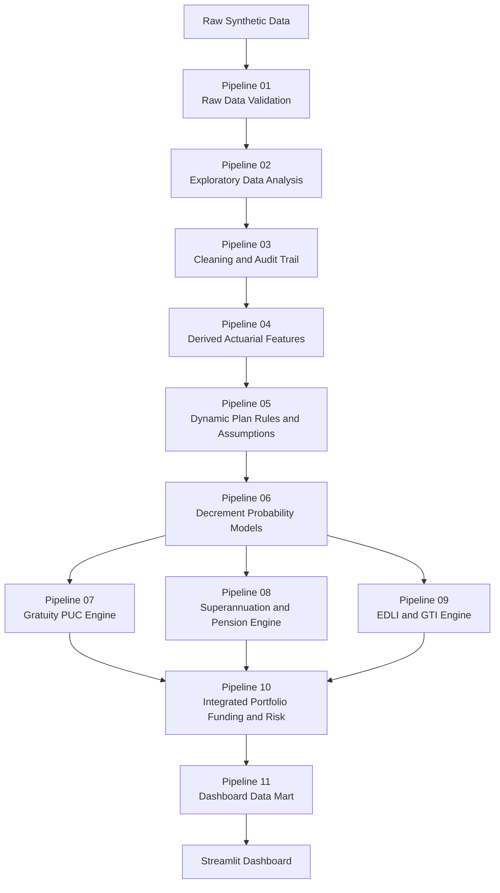

# Quantitative Actuarial Employee Benefits Dashboard

### Gratuity · Superannuation · Defined Benefit Pension · EDLI · Group Term Insurance

**Hessian-AI Employee Benefits Project**  
**Author:** Mangesh Janardan Bodke  
**Valuation Date:** 1 September 2026  
**Analytical Engine:** Pipelines 01–11  
**Dashboard Data Mart:** P11-C01  
**Technology:** Python · pandas · NumPy · Streamlit · Plotly  
**Data Classification:** Fully Synthetic

---

## Project Overview

This repository implements an end-to-end **quantitative actuarial modelling, employee-benefits valuation, group-insurance pricing, funding-analysis, model-governance and institutional decision-support framework**.

The project connects:

- employee-level data engineering;
- data-quality validation and audit controls;
- exploratory data analysis;
- controlled data cleaning;
- actuarial feature engineering;
- effective-dated plan rules;
- demographic decrement modelling;
- salary and financial projection;
- Projected Unit Credit valuation;
- Defined Contribution accumulation;
- Defined Benefit pension valuation;
- statutory EDLI analytics;
- Group Term Insurance pricing;
- funding and deficit analysis;
- workforce risk concentration;
- portfolio reconciliation;
- validation and governance;
- dashboard data engineering;
- and an interactive Streamlit application.

The central architectural principle is:

> **One controlled employee master → product-specific eligibility → governed actuarial assumptions → product-specific actuarial engines → financially distinct outputs → integrated portfolio analytics → dashboard-ready decision support.**

The framework covers five major employee-benefit and group-risk domains:

1. **Gratuity**
2. **Defined Contribution Superannuation**
3. **Defined Benefit Pension**
4. **Employees' Deposit Linked Insurance (EDLI)**
5. **Group Term Insurance (GTI)**

All employee, salary, plan, claims and asset information used in this repository is **synthetic**.

No confidential employer, employee, insurer, client or personally identifiable production information is used.

---

## Table of Contents

- [Current Portfolio Snapshot](#current-portfolio-snapshot)
- [System Architecture](#system-architecture)
- [Core Design Principles](#core-design-principles)
- [Repository Structure](#repository-structure)
- [Data Architecture](#data-architecture)
- [The 11-Pipeline Analytical Engine](#the-11-pipeline-analytical-engine)
- [Core Quantitative Modelling Framework](#core-quantitative-modelling-framework)
- [Competing Decrements](#competing-decrements)
- [Salary Projection](#salary-projection)
- [Present-Value Discounting](#present-value-discounting)
- [Gratuity Valuation](#gratuity-valuation)
- [Projected Unit Credit](#projected-unit-credit)
- [Defined Contribution Superannuation](#defined-contribution-superannuation)
- [Defined Benefit Pension](#defined-benefit-pension)
- [Group Term Insurance](#group-term-insurance)
- [GTI Experience and Credibility](#gti-experience-and-credibility)
- [Employees' Deposit Linked Insurance](#employees-deposit-linked-insurance)
- [Funding Analysis](#funding-analysis)
- [Validation and Governance](#validation-and-governance)
- [Dashboard Architecture](#dashboard-architecture)
- [Technology Stack](#technology-stack)
- [Installation and Execution](#installation-and-execution)
- [Streamlit Deployment Architecture](#streamlit-deployment-architecture)
- [Model Risk and Robustness](#model-risk-and-robustness)
- [Project Scope and Limitations](#project-scope-and-limitations)
- [Regulatory and Accounting Positioning](#regulatory-and-accounting-positioning)
- [Documentation Roadmap](#documentation-roadmap)
- [Methodological Companion](#methodological-companion)
- [Author](#author)
- [Disclaimer](#disclaimer)
- [License](#license)

---

## Current Portfolio Snapshot

The current validated synthetic portfolio produces the following integrated results.

| Metric | Validated Result |
|---|---:|
| Employee records after cleaning | **9,950** |
| Active employees | **8,898** |
| Active Gratuity members | **8,675** |
| Active DB Pension members | **1,314** |
| Active DC Superannuation members | **4,318** |
| Active EDLI members | **8,501** |
| Active GTI members | **7,913** |
| Gratuity DBO | **₹2,972,272,128.60** |
| DB Pension DBO | **₹1,658,425,182.15** |
| Combined Defined Benefit liability | **₹4,630,697,310.74** |
| Combined Defined Benefit plan assets | **₹1,648,171,000.00** |
| Combined DB funding ratio | **35.59%** |
| Combined DB net funded position | **-₹2,982,526,310.74** |
| Annual DC employer contributions | **₹583,902,430.07** |
| Annual DC employee contributions | **₹86,042,645.03** |
| Projected DC future-contribution corpus | **₹59,467,819,156.37** |
| GTI total Sum Assured | **₹26,662,668,000.00** |
| GTI fresh expected claims | **₹22,906,469.34** |
| GTI fresh-model gross premium | **₹28,633,086.68** |
| GTI Free Cover Limit referrals | **624** |
| GTI Free Cover Limit referral rate | **7.89%** |
| EDLI qualifying Part B lower analytical aggregate | **₹4,445,700,000.00** |
| EDLI qualifying Part B upper analytical aggregate | **₹5,927,600,000.00** |
| Pipeline 10 validation failures | **0** |
| Pipeline 11 validation failures | **0** |

> **Rounding note:** Displayed component values are rounded to two decimal places, while portfolio totals are calculated from underlying unrounded employee-level values. A ₹0.01 display-level difference may therefore occur when independently adding rounded component DBO values.

These figures are outputs of a **synthetic analytical environment** and are not production actuarial valuations, insurer quotations or statutory settlement amounts.

---

## System Architecture



The architecture deliberately separates:

- raw source data from processed data;
- validation from cleaning;
- employee data from plan-rule data;
- actuarial assumptions from benefit calculations;
- decrement probabilities from financial assumptions;
- Defined Benefit liabilities from Defined Contribution accumulations;
- statutory EDLI logic from GTI insurance pricing;
- validation failures from governance reviews;
- actuarial calculations from dashboard rendering.

---

## Core Design Principles

### One Employee Master

An employee is not duplicated merely because the employee participates in several benefit products.

One employee remains one employee.

Product participation is represented using:

- plan identifiers;
- eligibility rules;
- product membership flags.

---

### Dynamic Plan Rules

Benefit formulas are not assumed to be universal.

The employee record identifies the applicable plan, while the controlled rules layer defines:

- benefit formulas;
- salary bases;
- contribution rates;
- retirement ages;
- vesting conditions;
- financial assumptions;
- demographic assumptions;
- underwriting rules;
- statutory parameters.

---

### Effective-Date Governance

Rules can contain:

```text
effective_from
effective_to
```

This permits assumptions and statutory parameters to change across valuation dates without rewriting the calculation engine.

---

### Raw Data Preservation

The analytical system does not silently overwrite raw source files.

Cleaning produces:

- processed data;
- audit trails;
- exception records;
- model-ready datasets.

---

### Product Engines Remain Financially Distinct

The following are not treated as interchangeable financial measures:

- Gratuity DBO;
- DB Pension DBO;
- DC accumulation;
- EDLI analytical benefit;
- GTI Sum Assured;
- GTI expected claims;
- GTI premium;
- plan assets.

---

### Unsupported Precision Is Avoided

The framework does not manufacture information merely to produce a complete-looking output.

Examples include:

- unavailable individual DC opening corpus;
- incomplete historical GTI insured exposure;
- incomplete EDLI continuity information;
- missing spouse-continuation information;
- official statutory-calculator requirements.

---

## Repository Structure

```text
quantitative-actuarial-employee-benefits-dashboard/
│
├── Data/
│   │
│   ├── employee_census_raw.csv
│   ├── salary_history.csv
│   ├── claims_history.csv
│   ├── plan_assets.csv
│   ├── plan_rules_assumptions.csv
│   │
│   ├── processed/
│   ├── model_ready/
│   └── dashboard_ready/
│
├── Outputs/
│   ├── 01_data_validation/
│   ├── 02_eda/
│   ├── 03_cleaning/
│   ├── 04_features/
│   ├── 05_plan_rules/
│   ├── 06_decrements/
│   ├── 07_gratuity/
│   ├── 08_superannuation/
│   ├── 09_edli_gti/
│   ├── 10_portfolio_risk/
│   └── 11_dashboard_mart/
│
├── employee_benefits_pipeline.py
├── app.py
├── requirements.txt
├── .gitignore
└── README.md
```

The Streamlit application consumes only the controlled dashboard layer:

```text
Data/dashboard_ready/
```

The larger analytical and audit outputs remain available for transparency and reproducibility but are not recalculated during ordinary dashboard interaction.

---

## Data Architecture

The project begins with five connected synthetic source datasets.

### 1. Employee Census

Primary file:

```text
Data/employee_census_raw.csv
```

The employee census is the controlled employee master.

The project was designed around **10,000 synthetic employee rows before cleaning**, with deliberately injected data-quality issues.

Representative fields include:

- `employee_id`;
- demographic attributes;
- date of birth;
- date of joining;
- date of leaving;
- employment status;
- department;
- location;
- grade;
- salary anchors;
- PF indicators;
- EDLI indicators;
- `gratuity_plan_id`;
- `superannuation_plan_id`;
- `gti_plan_id`.

The product plan identifiers remain separate.

The benefit formula is not stored as a fixed employee value.

---

### 2. Salary History

Primary file:

```text
Data/salary_history.csv
```

Core fields include:

```text
employee_id
effective_date
basic_salary_monthly
dearness_allowance_monthly
gratuity_eligible_wages_monthly
pensionable_salary_annual
edli_eligible_wages_monthly
gross_compensation_annual
```

Salary data are time dependent.

For valuation purposes, the engine retrieves the latest defensible salary observation effective on or before:

**1 September 2026**

This prevents future salary observations from leaking into the valuation.

Different products may use different governed salary bases.

---

### 3. Claims History

Primary file:

```text
Data/claims_history.csv
```

Core fields include:

```text
claim_event_id
employee_id
event_date
event_type
product_type
product_plan_id
exposure_start_date
exposure_end_date
sum_assured_at_event
claim_amount
claim_status
```

The dataset supports:

- event analysis;
- historical claims diagnostics;
- exposure diagnostics;
- mortality experience analysis;
- Actual-to-Expected analysis.

A critical governance principle is:

> **A claims/event file is not automatically a complete historical insured-membership exposure census.**

This distinction becomes important in the GTI credibility framework.

---

### 4. Plan Assets

Primary file:

```text
Data/plan_assets.csv
```

Core fields include:

```text
plan_id
product_type
valuation_date
opening_plan_assets
employer_contributions
employee_contributions
investment_income
benefits_paid
expenses_charges
closing_plan_assets
```

Plan assets are maintained at plan or employer level.

They are not automatically treated as employee-level assets.

In particular:

> **Pooled plan assets are not substituted for unavailable individual DC member balances.**

---

### 5. Plan Rules and Actuarial Assumptions

Primary file:

```text
Data/plan_rules_assumptions.csv
```

Representative fields include:

```text
rule_id
plan_id
product_type
rule_category
parameter_name
parameter_value
value_type
unit
formula_template
effective_from
effective_to
dashboard_editable_flag
source_reference
```

The rules layer allows controlled plan-specific variation in:

- benefit formulas;
- contribution basis;
- contribution rates;
- salary basis;
- salary escalation;
- discount rates;
- expected investment return;
- charges;
- retirement age;
- vesting;
- spouse continuation;
- mortality;
- withdrawal;
- disability;
- pension escalation;
- GTI cover design;
- Free Cover Limits;
- EDLI analytical parameters.

---

## The 11-Pipeline Analytical Engine

### Pipeline 01 — Raw Data Validation

**Purpose:** Determine whether source data are structurally usable before cleaning or modelling begins.

Controls include:

- source-file availability;
- schema validation;
- column validation;
- employee-key integrity;
- duplicate detection;
- date parsing;
- chronology checks;
- salary checks;
- membership consistency;
- plan-reference validation;
- claims/exposure validation;
- asset validation;
- plan-rule validation.

Pipeline 01 validates.

It does not silently repair raw data.

---

### Pipeline 02 — Exploratory Data Analysis

**Purpose:** Quantify, profile and document data-quality behaviour before intervention.

The EDA layer examines:

- duplicate structures;
- conflicting employee observations;
- chronology exceptions;
- salary distributions;
- salary outliers;
- missingness;
- product-membership inconsistencies;
- salary-history inconsistencies;
- claims and exposure records;
- plan-asset continuity;
- plan-rule completeness.

Outputs are written to:

```text
Outputs/02_eda/
```

---

### Pipeline 03 — Cleaning and Audit Trail

**Purpose:** Produce defensible processed datasets while recording every material intervention.

Current synthetic cleaning results include:

| Cleaning Measure | Result |
|---|---:|
| Employee rows | **10,000 → 9,950** |
| Duplicate rows removed | **50** |
| DOB values imputed | **119** |
| DOJ values reconstructed | **349** |
| Exit dates recovered | **82** |
| Employment statuses reconciled | **15** |
| Current Basic Salaries reconstructed | **88** |
| Historical Basic Salaries repaired | **177** |
| Exposure starts reconstructed | **53** |
| Exposure ends reconstructed | **25** |
| Cleaning audit records | **1,561** |
| Post-cleaning validation failures | **0** |

Raw source files remain unchanged.

---

### Pipeline 04 — Derived Actuarial Features

**Purpose:** Convert cleaned administrative records into model-ready actuarial quantities.

Representative features include:

- attained age;
- completed service;
- remaining service;
- retirement horizon;
- expected retirement date;
- active employee flag;
- Gratuity membership;
- DB Pension membership;
- DC Superannuation membership;
- EDLI membership;
- GTI membership;
- salary experience;
- decrement exposure;
- input-quality status.

Current model-ready datasets include:

| Dataset | Shape |
|---|---:|
| Employee actuarial features | **9,950 × 89** |
| Salary experience features | **39,411 × 38** |
| Decrement exposure features | **42,421 × 48** |

Current active populations:

| Population | Count |
|---|---:|
| Active employees | **8,898** |
| Active Gratuity members | **8,675** |
| Active DB Pension members | **1,314** |
| Active DC Superannuation members | **4,318** |
| Active EDLI members | **8,501** |
| Active GTI members | **7,913** |

Feature validation failures:

```text
0
```

---

### Pipeline 05 — Dynamic Plan Rules and Actuarial Assumptions Engine

**Purpose:** Resolve effective plan rules without hard-coding one universal benefit formula.

Pipeline 05:

- selects effective-dated rules;
- validates parameter domains;
- validates controlled formula templates;
- creates plan inventories;
- distinguishes locked and editable parameters;
- maps employees to products and plans;
- validates required plan parameters;
- applies statutory governance controls;
- creates reusable parameter lookups.

The current framework contains **11 active plan designs** across the product architecture.

No DBO, premium or employee benefit is calculated in Pipeline 05.

It is the **rules and assumption-governance layer**.

---

### Pipeline 06 — Decrement Probability Models

**Purpose:** Model demographic exits from active employment.

The engine includes:

- Gompertz–Makeham mortality;
- Weibull withdrawal;
- annual disability modelling;
- probability-to-intensity transformation;
- early-retirement logistic calibration;
- competing-decrement survival;
- active-service projections;
- retirement-horizon determination.

Current selected outputs include:

| Metric | Result |
|---|---:|
| Current Gratuity decrement rows | **8,675** |
| Product mortality rows | **17,902** |
| Active-service projection rows | **197,293** |
| Employees projected to retirement | **8,627** |
| Zero/review retirement horizons | **48** |
| Employee-year logistic observations | **42,421** |
| Observed early retirements | **103** |
| MLE converged | **True** |
| Validation failures | **0** |

Pipeline 06 provides probability inputs to later product engines.

---

### Pipeline 07 — Gratuity Valuation / Projected Unit Credit

**Purpose:** Estimate Gratuity obligations under dynamic plan rules using a Projected Unit Credit framework.

The engine combines:

- employee service;
- projected salary;
- qualifying-service rules;
- vesting;
- death and disability treatment;
- mortality;
- withdrawal;
- disability;
- retirement;
- discounting;
- plan assets;
- sensitivity analysis.

Current result:

| Metric | Result |
|---|---:|
| Active Gratuity members | **8,675** |
| Employees included in DBO | **8,627** |
| Retirement-horizon review members | **48** |
| Gratuity plans valued | **3** |
| Company Gratuity DBO | **₹2,972,272,128.60** |
| PUC one-service-year PV | **₹402,766,733.06** |
| Gratuity plan assets | **₹659,564,000.00** |
| Funding ratio | **22.19%** |
| Net funded position | **-₹2,312,708,128.60** |
| Validation failures | **0** |

---

### Pipeline 08 — Superannuation Engine

Pipeline 08 intentionally separates **Defined Contribution Superannuation** from **Defined Benefit Pension**.

#### Defined Contribution Superannuation

The DC model calculates:

- contribution basis;
- employer contributions;
- employee contributions;
- contribution frequency;
- salary growth;
- expected investment return;
- charges;
- retirement horizon;
- projected future-contribution accumulation.

Current result:

| Metric | Result |
|---|---:|
| Active DC members | **4,318** |
| DC plans valued | **2** |
| Annual employer contributions | **₹583,902,430.07** |
| Annual employee contributions | **₹86,042,645.03** |
| Future-contribution corpus | **₹59,467,819,156.37** |
| Opening member corpus available | **0 / 4,318** |

The absence of individual opening balances is explicitly retained as a governance limitation.

---

#### Defined Benefit Pension

The DB Pension model incorporates:

- pensionable salary;
- salary escalation;
- benefit accrual;
- retirement age;
- competing-decrement survival;
- member pension;
- spouse continuation;
- pension escalation;
- pensioner mortality;
- present-value discounting;
- plan assets;
- sensitivity testing.

Current result:

| Metric | Result |
|---|---:|
| Active DB Pension members | **1,314** |
| DB Pension plans valued | **2** |
| Member pension DBO | **₹1,579,599,133.93** |
| Modelled spouse pension DBO | **₹78,826,048.22** |
| Total DB Pension DBO | **₹1,658,425,182.15** |
| PUC one-service-year PV | **₹202,900,075.23** |
| DB Pension plan assets | **₹988,607,000.00** |
| Funding ratio | **59.61%** |
| Net funded position | **-₹669,818,182.15** |
| Validation failures | **0** |

---

### Pipeline 09 — EDLI and Group Term Insurance Engine

Pipeline 09 intentionally keeps EDLI and GTI **legally, actuarially and financially distinct**.

#### EDLI

The model treats EDLI as:

- statutory;
- PF linked;
- effective-date sensitive;
- controlled through a statutory rule layer;
- subject to continuity and wage-history limitations;
- subject to official verification.

The analytical model does not represent an internally generated EDLI value as a final statutory settlement where required statutory information is unavailable.

#### GTI

The GTI engine calculates:

- employee Sum Assured;
- mortality probability;
- fresh expected claims;
- Free Cover Limit exposure;
- underwriting referrals;
- historical experience diagnostics;
- credibility diagnostics;
- premium loading;
- gross premium.

Current result:

| Metric | Result |
|---|---:|
| Active GTI members | **7,913** |
| GTI plans priced | **3** |
| Total Sum Assured | **₹26,662,668,000.00** |
| Fresh expected claims | **₹22,906,469.34** |
| FCL underwriting referrals | **624** |
| Validation failures | **0** |

---

### Pipeline 10 — Integrated Employee Benefits Portfolio, Funding and Risk Engine

**Purpose:** Integrate validated product-engine outputs without recalculating the underlying actuarial models.

Pipeline 10 produces:

- company-level KPIs;
- product-level summaries;
- plan-level summaries;
- employee-level cross-product risk;
- combined Defined Benefit funding;
- workforce concentration;
- GTI concentration;
- portfolio reconciliation;
- consolidated governance.

Current position:

| Metric | Result |
|---|---:|
| Gratuity DBO | **₹2,972,272,128.60** |
| DB Pension DBO | **₹1,658,425,182.15** |
| Combined DB liability | **₹4,630,697,310.74** |
| Combined DB assets | **₹1,648,171,000.00** |
| Combined DB funding ratio | **35.59%** |
| Combined DB net funded position | **-₹2,982,526,310.74** |
| Validation failures | **0** |

Pipeline 10 does not add DC accumulation to Defined Benefit liabilities.

It also excludes the unsupported historical GTI credibility premium from final portfolio KPIs.

---

### Pipeline 11 — Dashboard Data Mart and Visualization Layer

**Purpose:** Convert validated Pipeline 10 outputs into lightweight visualization-ready datasets.

Pipeline 11 performs **presentation engineering**, not actuarial revaluation.

Current dashboard mart:

| Component | Rows / Count |
|---|---:|
| Executive KPI cards | **16** |
| Product overview rows | **5** |
| Plan overview rows | **11** |
| Employee detail rows | **9,950** |
| Segment concentration rows | **18** |
| Governance rows | **13** |
| Pipeline 10 validation rows | **15** |
| Dashboard filter values | **29** |
| Approved dashboard visuals | **12** |
| Pipeline 11 validation failures | **0** |

Dashboard-ready files are written to:

```text
Data/dashboard_ready/
```

---

## Core Quantitative Modelling Framework

### 1. Gompertz–Makeham Mortality

Mortality intensity at attained age \(x\) is modelled as:

```math
\mu_x = A + Bc^x
```

where:

- \(A\) = age-independent Makeham mortality component;
- \(B\) = scale of age-dependent mortality;
- \(c\) = age-to-age mortality growth factor;
- \(x\) = attained age.

Future survival over \(t\) years is:

```math
{}_{t}p_x = \exp\left(-\int_0^t \mu_{x+s}\,ds\right)
```

For the Gompertz–Makeham form, the integrated survival expression can be written as:

```math
{}_{t}p_x = \exp\left[-At-\frac{Bc^x}{\ln(c)}\left(c^t-1\right)\right]
```

The corresponding death probability is:

```math
{}_{t}q_x = 1-{}_{t}p_x
```

A central distinction is:

```math
\mu_x \neq q_x
```

because an instantaneous hazard/intensity is not the same mathematical object as a finite-period event probability.

Representative synthetic parameters used in the controlled model include:

```math
A = 0.0002
```

```math
B = 0.00001
```

```math
c = 1.10
```

These are synthetic modelling parameters and are not represented as insurer mortality tables.

---

### 2. Weibull Withdrawal Model

Employee withdrawal is modelled as a service-duration process.

The Weibull survival function is:

```math
S(t) = \exp\left[-\left(\frac{t}{\eta}\right)^k\right]
```

where:

- \(\eta\) = Weibull scale parameter;
- \(k\) = Weibull shape parameter;
- \(t\) = completed service duration.

The corresponding withdrawal hazard is:

```math
h(t) = \frac{k}{\eta}\left(\frac{t}{\eta}\right)^{k-1}
```

The conditional probability of withdrawal during the next year, given survival in employment to service \(s\), is:

```math
q^{w}(s) = 1-\frac{S(s+1)}{S(s)}
```

Interpretation of \(k\):

- \(k < 1\): declining withdrawal hazard;
- \(k = 1\): constant withdrawal hazard;
- \(k > 1\): increasing withdrawal hazard.

---

### 3. Disability Modelling

The distributional representation depends on the observation structure.

#### Employee-Level Binary Outcome

```math
Y_i \sim \mathrm{Bernoulli}(q_i)
```

where:

- \(Y_i=1\) indicates a disability event;
- \(q_i\) is the annual disability probability.

#### Homogeneous Portfolio Event Count

```math
N \sim \mathrm{Binomial}(n,q)
```

where:

- \(n\) = number of employees exposed;
- \(q\) = common event probability.

#### Rare-Event Count Over Exposure

```math
N \sim \mathrm{Poisson}(E\lambda)
```

where:

- \(E\) = employee-year exposure;
- \(\lambda\) = event intensity.

The framework therefore does not mechanically assign one distribution to every disability dataset.

---

### 4. Probability-to-Intensity Conversion

For an annual event probability \(q\), a constant annual intensity can be represented as:

```math
\lambda = -\ln(1-q)
```

Conversely:

```math
q = 1-\exp(-\lambda)
```

This transformation is useful when competing decrement models are expressed through intensities.

---

### 5. Early-Retirement Logistic Model

For employee \(i\):

```math
p_i = \frac{1}{1+\exp(-\eta_i)}
```

with linear predictor:

```math
\eta_i = \beta_0+\beta_1X_{1i}+\beta_2X_{2i}+\cdots+\beta_pX_{pi}
```

The current synthetic calibration uses employee age and service information.

Current calibration diagnostics include:

```text
Employee-year observations: 42,421
Observed early retirements: 103
Maximum-likelihood convergence: True
```

The output is used as a demographic decrement component.

It is not an employee-management recommendation.

---

## Competing Decrements

Employees may simultaneously be exposed to several mutually exclusive exit causes, including:

- death;
- withdrawal;
- disability;
- early retirement;
- normal retirement.

Cause-specific decrement probabilities cannot simply be added without considering their interaction.

For cause-specific intensities \(\lambda_j(t)\), total active-state survival may be represented as:

```math
S(t) = \exp\left[-\int_0^t\sum_j\lambda_j(s)\,ds\right]
```

When intensities are approximately constant over a short interval, total intensity is:

```math
\lambda_{\mathrm{total}} = \sum_j \lambda_j
```

The probability of any decrement during a one-year interval is then:

```math
q_{\mathrm{total}} = 1-\exp(-\lambda_{\mathrm{total}})
```

A cause-specific decrement probability can be allocated proportionally to its intensity:

```math
q_j = \frac{\lambda_j}{\lambda_{\mathrm{total}}}\left(1-\exp(-\lambda_{\mathrm{total}})\right)
```

This preserves the total probability bound and avoids double counting competing exits.

The modelling sequence is:

> **Standalone decrement models → intensity/probability reconciliation → competing-decrement survival → active-service projection → benefit cash flows.**

---

## Salary Projection

Salary-linked benefits require projected remuneration.

A simplified annual salary projection is:

```math
S_t = S_0(1+g)^t
```

where:

- \(S_0\) = salary at the valuation date;
- \(g\) = annual salary-escalation assumption;
- \(t\) = projection horizon in years.

Salary escalation is controlled by plan.

Different products may use different salary definitions:

- basic salary;
- dearness allowance;
- Gratuity-eligible wages;
- pensionable salary;
- EDLI-eligible wages;
- gross compensation.

---

## Present-Value Discounting

For annual discount rate \(i\), the one-year discount factor is:

```math
v = \frac{1}{1+i}
```

The discount factor for \(t\) years is:

```math
v^t = \frac{1}{(1+i)^t}
```

For deterministic future cash flows \(CF_t\):

```math
PV = \sum_t CF_t v^t
```

For probability-weighted actuarial cash flows:

```math
EPV = \sum_t p_t CF_t v^t
```

where \(p_t\) is the relevant survival, decrement or payment probability.

---

## Gratuity Valuation

Gratuity is modelled dynamically by plan.

A generic projected benefit structure can be represented as:

```math
B_t = \frac{d_b}{d_v}\times S_t\times Y_t
```

where:

- \(d_b\) = governed benefit days;
- \(d_v\) = governed divisor days;
- \(S_t\) = projected eligible monthly salary;
- \(Y_t\) = qualifying service at the benefit event.

The exact formula is controlled by the applicable plan.

Plan rules may differ by:

- benefit days;
- divisor;
- salary basis;
- vesting period;
- death vesting waiver;
- disability vesting waiver;
- service-rounding convention;
- salary escalation;
- retirement age;
- discount rate.

The framework therefore avoids imposing a universal fixed Gratuity formula on every plan.

---

## Projected Unit Credit

Projected Unit Credit allocates the projected benefit to service periods.

For employee \(i\), a conceptual obligation can be represented as:

```math
DBO_i = \sum_t P_{i,t}\times B_{i,t}^{\mathrm{accrued}}\times v^t
```

where:

- \(DBO_i\) = employee Defined Benefit Obligation;
- \(P_{i,t}\) = probability of the relevant benefit payment;
- \(B_{i,t}^{\mathrm{accrued}}\) = projected benefit attributable to service earned by the valuation date;
- \(v^t\) = discount factor.

Company DBO is:

```math
DBO = \sum_i DBO_i
```

The engine also calculates a one-service-year present-value measure for PUC analysis.

---

## Defined Contribution Superannuation

DC Superannuation is treated as an **accumulation problem**, not a Defined Benefit liability.

If contribution at future time \(t\) is \(C_t\), projected accumulation to retirement \(T\) may be represented as:

```math
FV = \sum_{t=1}^{T} C_t(1+r_{\mathrm{net}})^{T-t}
```

where:

- \(FV\) = future-contribution corpus;
- \(T\) = retirement horizon;
- \(C_t\) = contribution at time \(t\);
- \(r_{\mathrm{net}}\) = governed accumulation rate after applicable charges.

For salary-linked contributions:

```math
C_t = c\times S_t
```

where:

- \(c\) = applicable contribution rate;
- \(S_t\) = contribution salary basis.

Employer and employee contributions remain separately identifiable.

A major governance rule is:

> **Pooled plan assets are not substituted for unavailable employee-level opening DC corpus.**

The current DC output therefore represents a **future-contribution corpus**, not a reconstructed total member account balance.

---

## Defined Benefit Pension

A simplified annual pension at retirement may be represented as:

```math
P_R = a\times Y_R\times S_R
```

where:

- \(P_R\) = annual pension at retirement;
- \(a\) = pension accrual rate;
- \(Y_R\) = service at retirement;
- \(S_R\) = projected pensionable salary.

The liability also reflects the probability that the employee reaches retirement while remaining eligible.

A conceptual valuation structure is:

```math
DBO_i = {}_{T}p_x\times v^T\times PV_R(\mathrm{member\ pension}) + PV_0(\mathrm{spouse\ pension})
```

where:

- \({}_{T}p_x\) = probability of reaching retirement in active service;
- \(T\) = years to retirement;
- \(v^T\) = discount factor to retirement;
- \(PV_R\) = value at retirement;
- \(PV_0\) = present value at the valuation date.

Member pension and spouse pension remain separately identifiable before being reconciled into total DB Pension DBO.

---

### Pension Escalation

If pension at retirement is \(P_R\) and pension escalation is \(e\), the pension after \(u\) retirement years is:

```math
P_{R+u} = P_R(1+e)^u
```

The projected pension stream is then combined with:

- pensioner survival;
- spouse-continuation assumptions;
- discounting.

---

## Group Term Insurance

GTI is treated as an insurance-risk pricing problem rather than a Defined Benefit obligation.

The current synthetic environment includes three plan designs.

### GTI_FLAT_01

Flat cover:

```math
SA_i = 2{,}000{,}000
```

---

### GTI_SAL_02

Raw salary-multiple cover:

```math
SA_i^{\mathrm{raw}} = 3\times \mathrm{GrossCompensation}_i
```

Subject to minimum and maximum plan limits:

```math
SA_i = \min\left(10{,}000{,}000,\max\left(1{,}500{,}000,SA_i^{\mathrm{raw}}\right)\right)
```

---

### GTI_GRADE_03

Grade-based cover:

| Grade | Sum Assured |
|---|---:|
| E1 | ₹1,500,000 |
| E2 | ₹2,000,000 |
| E3 | ₹2,500,000 |
| E4 | ₹3,000,000 |
| E5 | ₹4,000,000 |
| E6 | ₹5,000,000 |
| E7 | ₹7,500,000 |
| E8 | ₹10,000,000 |

---

### Free Cover Limit

Each GTI plan contains a governed Free Cover Limit.

An underwriting referral indicator can be represented as:

```math
I_i^{\mathrm{FCL}} = 1\quad\mathrm{when}\quad SA_i>\mathrm{FCL}
```

Current portfolio result:

```text
FCL referrals: 624
Referral rate: 7.89%
```

The referral does not remove the employee from the analytical pricing population.

It identifies an underwriting review requirement.

---

### GTI Expected Claims

For employee \(i\):

```math
EC_i = E_i\times q_i\times SA_i
```

where:

- \(E_i\) = insured exposure;
- \(q_i\) = mortality probability;
- \(SA_i\) = Sum Assured.

Portfolio expected claim cost is:

```math
EC = \sum_i E_i\times q_i\times SA_i
```

Current fresh expected claim cost:

```text
₹22,906,469.34
```

---

### GTI Gross Premium

Let \(L\) represent the governed gross-premium loading rate.

The pricing structure is:

```math
GP = \frac{EC}{1-L}
```

Current synthetic loading:

```math
L = 0.20
```

Therefore:

```math
GP = \frac{22{,}906{,}469.34}{1-0.20}
```

producing:

```text
₹28,633,086.68
```

This **fresh-model gross premium** is the GTI premium used in the final integrated dashboard.

---

## GTI Experience and Credibility

### Actual-to-Expected Mortality

Historical mortality experience may be summarized using:

```math
A/E = \frac{\mathrm{Actual\ Deaths}}{\mathrm{Expected\ Deaths}}
```

Interpretation:

- \(A/E>1\): actual mortality exceeds expectation;
- \(A/E<1\): actual mortality is below expectation;
- \(A/E=1\): actual mortality equals expectation.

A valid Expected denominator requires complete and defensible historical insured exposure.

---

### Limited-Fluctuation Credibility

An approximate full-credibility requirement can be represented as:

```math
N_{\mathrm{full}} = \left(\frac{z}{k}\right)^2
```

where:

- \(z\) = confidence parameter;
- \(k\) = permitted relative fluctuation.

With:

```math
z = 1.96
```

and:

```math
k = 0.10
```

the synthetic analytical full-credibility benchmark is:

```math
N_{\mathrm{full}} = 384.16
```

Partial credibility may be represented as:

```math
Z = \min\left(1,\sqrt{\frac{E}{N_{\mathrm{full}}}}\right)
```

where \(E\) represents the historical expected-event volume used by the credibility calculation.

A credibility-weighted experience factor may be represented as:

```math
F = Z\times(A/E)+(1-Z)
```

---

### Critical GTI Model-Risk Decision

Historical `claims_history.csv` records contain events and claims.

They do **not** constitute a complete historical insured-membership census for every employee and every historical period.

Therefore the historical Expected-death denominator is not sufficiently defensible for final credibility pricing.

Using the incomplete exposure denominator produced disproportionate A/E factors.

The controlled modelling decision is therefore:

> **Historical A/E and credibility results are retained for diagnostic and audit purposes, but the credibility-adjusted premium is excluded from the final dashboard KPI.**

The final dashboard premium is:

```math
\mathrm{Fresh\ Gross\ Premium} = \frac{\mathrm{Fresh\ Expected\ Claims}}{1-L}
```

This decision prevents unsupported historical precision from entering the management pricing output.

---

## Employees' Deposit Linked Insurance

EDLI is intentionally treated differently from GTI.

Within this project it is handled as:

- statutory;
- provident-fund linked;
- effective-date sensitive;
- rule controlled;
- continuity sensitive;
- wage-history sensitive;
- subject to official verification.

The model does not present an internally calculated analytical amount as a final official settlement where complete statutory inputs are unavailable.

---

### Controlled EDLI Analytical Rule Set

The current project rule table contains the following effective-dated analytical parameters.

| Parameter | Controlled Model Value |
|---|---:|
| Rule set | `EDLI_STAT_CURRENT` |
| Effective from | **18 July 2025** |
| Wage factor | **35** |
| Monthly wage ceiling | **₹15,000** |
| PF component rate | **0.50** |
| PF component cap | **₹175,000** |
| Illustrative minimum benefit | **₹250,000** |
| Illustrative maximum benefit | **₹700,000** |
| Part A minimum floor | **₹50,000** |
| Continuity-gap parameter | **60 days** |
| Official calculator required | **TRUE** |

> These are the parameters stored in this project's controlled analytical rule table. Their presence in the model must not be interpreted as independent legal advice or a guarantee that they represent every rule applicable to every real-world EDLI claim.

---

### EDLI Analytical Structure

For eligible monthly wage \(W_i\), the project-controlled analytical wage component may be represented as:

```math
WC_i = 35\times\min(W_i,15{,}000)
```

An analytical PF component may be represented as:

```math
PFC_i = \min(0.5\times APB_i,175{,}000)
```

where \(APB_i\) represents Average Progressive Balance when defensibly available.

An analytical combination can then be represented as:

```math
B_i = WC_i+PFC_i
```

subject to the governed floors, caps, effective dates and continuity conditions contained in the rule engine.

The analytical result is not automatically the final official EDLI settlement.

---

### Current EDLI Governance

Current non-failure governance items include:

- incomplete continuity information for the synthetic current population;
- incomplete true 12-month historical wage information;
- historical EDLI events requiring historical rule selection;
- official-calculator processing;
- analytical proxy disclosure.

The system does not silently infer statutory continuity from ordinary completed service.

The system also does not back-cast the current rule table to historical events that occurred under earlier rule environments.

---

## Funding Analysis

For a funded Defined Benefit arrangement:

```math
\mathrm{Funding\ Ratio} = \frac{\mathrm{Plan\ Assets}}{\mathrm{Defined\ Benefit\ Liability}}
```

Net funded position is:

```math
\mathrm{Net\ Funded\ Position} = \mathrm{Plan\ Assets}-\mathrm{Liability}
```

Funding deficit may be represented as:

```math
\mathrm{Funding\ Deficit} = \mathrm{Liability}-\mathrm{Plan\ Assets}
```

---

### Combined Defined Benefit Position

The integrated portfolio defines:

```math
L_{\mathrm{DB}} = L_{\mathrm{Gratuity}}+L_{\mathrm{DB\ Pension}}
```

Pipeline 10 reports:

```text
Gratuity DBO:       ₹2,972,272,128.60
DB Pension DBO:     ₹1,658,425,182.15
Combined DB DBO:    ₹4,630,697,310.74
```

The combined total is calculated from underlying unrounded employee-level results.

Combined DB assets are:

```text
₹1,648,171,000.00
```

The funding ratio is:

```math
\frac{1{,}648{,}171{,}000}{4{,}630{,}697{,}310.74} = 35.5923\%
```

Displayed to two decimal places:

```text
35.59%
```

The current net funded position is:

```text
-₹2,982,526,310.74
```

---

### Why DC Is Not Added to DB Liability

DC accumulation and DB liability have different financial meanings.

The DC corpus represents accumulated future contributions.

A Defined Benefit obligation represents the present value of a promised benefit.

Therefore:

```math
L_{\mathrm{DB}} \neq L_{\mathrm{Gratuity}}+L_{\mathrm{DB\ Pension}}+FV_{\mathrm{DC}}
```

Instead:

```math
L_{\mathrm{DB}} = L_{\mathrm{Gratuity}}+L_{\mathrm{DB\ Pension}}
```

The DC future-contribution corpus is displayed separately.

---

## Validation and Governance

The framework deliberately separates **validation failures** from **governance reviews**.

### Validation Failure

A validation failure indicates that a mathematical, structural or reconciliation condition has failed.

Examples include:

- duplicate employee keys;
- broken plan mappings;
- impossible chronology;
- probabilities outside valid bounds;
- negative liabilities where not economically permissible;
- broken funding identities;
- plan totals not reconciling to employee totals;
- dashboard totals not reconciling to portfolio totals;
- missing mandatory model outputs.

A validation failure requires investigation or correction.

---

### Governance Review

A governance review represents a controlled limitation, fallback or business-review requirement.

Examples include:

- unavailable individual DC opening corpus;
- incomplete spouse continuation information;
- DB decrement fallback cases;
- EDLI continuity limitations;
- EDLI wage-history limitations;
- historical EDLI rule requirements;
- GTI Free Cover Limit referrals;
- incomplete historical GTI exposure;
- official statutory-calculator requirements.

Governance items remain visible but are not automatically classified as mathematical failures.

---

### Current Validation Status

| Engine | Validation Failures |
|---|---:|
| Pipeline 06 — Decrement Probability Models | **0** |
| Pipeline 07 — Gratuity | **0** |
| Pipeline 08 — Superannuation / Pension | **0** |
| Pipeline 09 — EDLI / GTI | **0** |
| Pipeline 10 — Integrated Portfolio | **0** |
| Pipeline 11 — Dashboard Data Mart | **0** |

---

## Dashboard Architecture

The Streamlit application consumes the validated Pipeline 11 layer:

```text
Data/dashboard_ready/
```

It does **not** rerun the actuarial valuation every time a dashboard filter changes.

The architecture is:

```text
Actuarial Engine
      ↓
Validated Product Outputs
      ↓
Integrated Portfolio
      ↓
Dashboard Data Mart
      ↓
Streamlit Visualization Layer
```

This separation improves:

- reproducibility;
- performance;
- auditability;
- model governance;
- deployment stability.

---

### Dashboard-Ready Files

Pipeline 11 creates:

```text
Data/dashboard_ready/
├── dashboard_kpi_cards.csv
├── dashboard_product_overview.csv
├── dashboard_plan_overview.csv
├── dashboard_employee_detail.csv
├── dashboard_segment_risk.csv
├── dashboard_governance.csv
├── dashboard_validation.csv
├── dashboard_filters.csv
├── dashboard_visual_catalog.csv
└── dashboard_manifest.csv
```

---

### Dashboard Page 1 — Executive Overview

Displays:

- active employee population;
- product membership;
- combined DB liability;
- DB assets;
- funding ratio;
- funding deficit;
- GTI Sum Assured;
- GTI fresh expected claims;
- GTI fresh gross premium;
- FCL referrals;
- FCL referral rate;
- liability comparison.

---

### Dashboard Page 2 — Funding & Liabilities

Displays:

- Gratuity DBO;
- DB Pension DBO;
- funded plan assets;
- funding gaps;
- plan funding ratios;
- liability-versus-assets comparison.

---

### Dashboard Page 3 — DC Superannuation

Displays:

- DC members;
- employer contributions;
- employee contributions;
- projected future-contribution corpus;
- plan comparisons;
- opening-corpus governance limitation.

---

### Dashboard Page 4 — Group Risk: GTI & EDLI

#### GTI

Displays:

- Sum Assured;
- fresh expected claims;
- fresh gross premium;
- plan-level risk;
- Free Cover Limit referrals.

#### EDLI

Displays:

- covered employees;
- analytical Part B range;
- effective-date governance;
- statutory limitations;
- official-calculator requirement.

---

### Dashboard Page 5 — Workforce Concentration

Allows analysis by:

- department;
- location;
- grade.

Measures include:

- Defined Benefit liability;
- DC future-contribution corpus;
- GTI Sum Assured;
- GTI expected claims;
- GTI gross premium.

---

### Dashboard Page 6 — Employee Drill-Down

Supports employee-level filtering by:

- department;
- location;
- grade;
- plan;
- actuarial liability;
- DC contribution;
- GTI exposure;
- underwriting status;
- EDLI analytical information.

Filtered results can be exported directly from the application.

---

### Dashboard Page 7 — Governance & Validation

Displays:

- validation checks;
- validation failures;
- governance review items;
- controlled fallbacks;
- data limitations;
- underwriting review items.

The dashboard explicitly distinguishes governance reviews from mathematical failures.

---

## Technology Stack

| Layer | Technology |
|---|---|
| Programming language | Python |
| Data engineering | pandas |
| Numerical computing | NumPy |
| Actuarial modelling | Python numerical routines |
| Dashboard framework | Streamlit |
| Interactive visualization | Plotly |
| Development environment | VS Code |
| Version control | Git |
| Repository hosting | GitHub |
| Deployment target | Streamlit Community Cloud |
| Primary data format | CSV |
| Documentation | Markdown |

---

## Installation and Execution

### Clone the Repository

Using GitHub SSH authentication:

```bash
git clone git@github.com:MangeshTheMathematician/quantitative-actuarial-employee-benefits-dashboard.git
```

Enter the repository:

```bash
cd quantitative-actuarial-employee-benefits-dashboard
```

Install Python dependencies:

```bash
python -m pip install -r requirements.txt
```

---

### Current Python Dependencies

The current `requirements.txt` contains:

```text
streamlit
pandas
numpy
plotly
```

For a future controlled production release, dependency versions may be pinned to improve environment reproducibility.

---

### Run the Complete Analytical Pipeline

From the repository root:

```bash
python employee_benefits_pipeline.py
```

The pipeline writes outputs to:

```text
Data/processed/
Data/model_ready/
Data/dashboard_ready/

Outputs/01_data_validation/
Outputs/02_eda/
Outputs/03_cleaning/
Outputs/04_features/
Outputs/05_plan_rules/
Outputs/06_decrements/
Outputs/07_gratuity/
Outputs/08_superannuation/
Outputs/09_edli_gti/
Outputs/10_portfolio_risk/
Outputs/11_dashboard_mart/
```

A successful current run ends with:

```text
Pipeline 11 validation failures: 0

Pipeline 11 complete.
No actuarial valuation formulas were recalculated.
Pipeline 10 outputs were converted into dashboard-ready data.
Historical GTI credibility pricing remains excluded from final KPIs.
The data layer is ready for the Streamlit application.
```

---

### Run the Streamlit Dashboard Locally

From the repository root:

```bash
python -m streamlit run app.py
```

The dashboard has been successfully tested locally.

---

## Streamlit Deployment Architecture

The deployment flow is:

```text
Local Development
        ↓
Git Commit
        ↓
GitHub Repository
        ↓
Streamlit Community Cloud
        ↓
Public Interactive Dashboard
```

The Streamlit entrypoint is:

```text
app.py
```

Dependencies are declared in:

```text
requirements.txt
```

The deployed application reads:

```text
Data/dashboard_ready/
```

No production credentials or confidential data are required for the current public synthetic dashboard.

---

## Reproducibility and Data Lineage

The complete analytical lineage is:

```text
Raw Synthetic Data
        ↓
Pipeline 01 — Validation
        ↓
Pipeline 02 — EDA
        ↓
Pipeline 03 — Cleaning
        ↓
Pipeline 04 — Actuarial Features
        ↓
Pipeline 05 — Rules and Assumptions
        ↓
Pipeline 06 — Decrement Models
        ↓
Pipelines 07–09 — Product Engines
        ↓
Pipeline 10 — Integrated Portfolio
        ↓
Pipeline 11 — Dashboard Data Mart
        ↓
Streamlit
```

Each analytical stage produces explicit outputs rather than concealing transformations inside the visualization layer.

---

## Model Risk and Robustness

### Controlled Inputs

Actuarial and financial assumptions are separated from valuation code.

---

### Explicit Fallbacks

Fallback assumptions are documented.

They are not silently hidden inside output values.

---

### Cross-Level Reconciliation

Employee-level outputs reconcile upward to:

- plans;
- products;
- company totals;
- dashboard totals.

---

### Financial Meaning Is Preserved

The architecture prevents inappropriate aggregation between:

- liabilities;
- plan assets;
- DC accumulations;
- statutory benefits;
- insured Sum Assured;
- expected claims;
- insurance premiums.

---

### Historical Experience Is Not Automatically Trusted

Historical information must contain a defensible exposure denominator before it is allowed to materially alter final pricing.

This principle drove the exclusion of the unsupported GTI credibility-adjusted premium from the final dashboard.

---

### Data Quality Is Not Hidden

Missing or incomplete inputs remain visible through:

- validation;
- governance reports;
- audit trails;
- review flags.

---

### Numerical and Reporting Precision Are Distinguished

Model calculations retain underlying numerical precision.

Presentation layers may round financial values for readability.

This distinction explains occasional small display-level reconciliation differences.

---

## Project Scope and Limitations

This repository demonstrates the intersection of:

- actuarial mathematics;
- probability theory;
- survival analysis;
- decrement modelling;
- financial mathematics;
- employee-benefit valuation;
- Defined Benefit funding;
- Defined Contribution accumulation;
- pension modelling;
- statutory-benefit analytics;
- group-insurance pricing;
- experience analysis;
- credibility;
- data engineering;
- model governance;
- risk concentration;
- interactive analytics;
- institutional decision support.

Important limitations include:

1. **All employee and plan data are synthetic.**

2. No production employer, employee or insurer data are included.

3. Mortality parameters are synthetic model parameters rather than insurer mortality tables.

4. The project is not a substitute for a qualified professional actuarial valuation.

5. Individual opening DC member corpus is unavailable in the current synthetic source data.

6. Historical GTI data do not provide a complete insured-member exposure census suitable for final credibility pricing.

7. EDLI statutory calculations require effective-date processing and official verification.

8. Historical EDLI events may require historical statutory rule sets rather than the current stored rule set.

9. Pension and spouse-pension assumptions are modelling assumptions and must not be interpreted as actual employer benefit promises.

10. Accounting treatment depends on the applicable employer, jurisdiction, accounting framework and valuation purpose.

11. Synthetic results must be interpreted only within the assumptions and data structure used by this project.

---

## Regulatory and Accounting Positioning

Employee-benefit regulation, statutory benefit rules and accounting requirements vary by:

- jurisdiction;
- valuation date;
- employer;
- plan design;
- policy terms;
- accounting framework.

A production engagement may require consideration of:

- applicable Indian employee-benefit legislation;
- provident-fund requirements;
- EDLI rules;
- plan documentation;
- trust arrangements;
- insurer contracts;
- funding policy;
- accounting standards;
- actuarial professional standards.

Accounting frameworks may include, where applicable:

- IAS 19;
- Ind AS 19;
- other employer-specific or jurisdiction-specific requirements.

The project architecture allows assumptions and statutory parameters to be versioned rather than permanently embedded into source code.

Before any real-world use, relevant:

- legal provisions;
- statutory rules;
- policy terms;
- accounting standards;
- actuarial assumptions;
- effective dates

must be independently verified.

---

## Documentation Roadmap

The project is designed around three documentation layers.

### 1. README

This document provides:

- project purpose;
- architecture;
- datasets;
- pipeline structure;
- major formulas;
- assumptions;
- modelling decisions;
- validated outputs;
- governance;
- limitations;
- setup;
- deployment architecture.

---

### 2. Extensively Commented Python Source

The source files:

```text
employee_benefits_pipeline.py
```

and:

```text
app.py
```

contain extensive comments explaining:

- data flow;
- actuarial logic;
- financial logic;
- probability models;
- calculations;
- validations;
- governance decisions;
- dashboard construction.

---

### 3. Explained-Code Technical PDF

A consolidated technical PDF is planned as the final documentation layer.

It will explain:

- each pipeline;
- important functions;
- major code blocks;
- formulas;
- notation;
- actuarial interpretation;
- financial interpretation;
- assumptions;
- input/output lineage;
- validation controls;
- governance controls;
- dashboard architecture;
- deployment logic.

The PDF will complement the source code and README rather than replace them.

---

## Methodological Companion

The analytical framework follows the broader methodology developed in the companion manuscript:

> **Bodke, Mangesh Janardan. _Quantitative Actuarial Modelling of Employee Benefits: A Comprehensive Framework for Gratuity, Superannuation, Employees' Deposit Linked Insurance and Group Term Insurance._ Hessian-AI independent manuscript, 2026.**

The companion framework develops the project logic across:

- probability modelling;
- survival models;
- decrement modelling;
- salary projection;
- present-value mathematics;
- employee-benefit valuation;
- pension modelling;
- funding;
- statutory benefits;
- group-insurance pricing;
- credibility;
- actuarial governance;
- numerical implementation.

---

## Design Philosophy

The modelling philosophy is:

> **Simplest meaning → exact theory → formula → numerical interpretation → actuarial meaning → assumptions → implementation → institutional application.**

The project therefore prioritizes:

1. actuarial meaning;
2. financial meaning;
3. mathematical correctness;
4. transparent assumptions;
5. reproducibility;
6. auditability;
7. model governance;
8. numerical implementation;
9. decision-support visualization.

Coding is the implementation layer.

The actuarial, probabilistic and financial logic remains the primary layer.

---

## Current Project Status

| Component | Status |
|---|---|
| Raw data validation | **Complete** |
| Exploratory data analysis | **Complete** |
| Controlled cleaning | **Complete** |
| Actuarial feature engineering | **Complete** |
| Dynamic plan-rule engine | **Complete** |
| Decrement probability models | **Complete** |
| Gratuity PUC valuation | **Complete** |
| DC Superannuation engine | **Complete** |
| DB Pension engine | **Complete** |
| EDLI analytical engine | **Complete** |
| GTI pricing engine | **Complete** |
| Integrated portfolio engine | **Complete** |
| Dashboard data mart | **Complete** |
| Local Streamlit application | **Running successfully** |
| GitHub repository | **Active** |
| Streamlit Community Cloud | **Deployment stage** |
| Explained-code technical PDF | **Planned final documentation stage** |

---

## Author

**Mangesh Janardan Bodke**

**Hessian-AI Employee Benefits Project**

GitHub account:

```text
MangeshTheMathematician
```

This project demonstrates the integration of:

- actuarial mathematics;
- probability modelling;
- financial valuation;
- employee-benefit modelling;
- insurance pricing;
- data engineering;
- model governance;
- institutional risk analytics;
- quantitative decision support.

---

## Disclaimer

This repository is provided for **educational, analytical, research and portfolio-demonstration purposes**.

It does not constitute:

- actuarial advice;
- legal advice;
- regulatory advice;
- accounting advice;
- investment advice;
- insurance advice;
- tax advice;
- employment advice.

All project data are synthetic.

Statutory benefits, professional standards, policy terms, accounting requirements, actuarial assumptions and effective dates must be independently verified before any real-world application.

No:

- insurer;
- reinsurer;
- employer;
- regulator;
- professional body;
- academic institution;
- government agency;
- or other third party

is represented as endorsing this repository.

---

## License

No open-source license is currently granted with this repository.

Unless a license is added separately, the code, documentation and manuscript-related material remain subject to applicable copyright law.

---

### Hessian-AI — Quantitative Actuarial Employee Benefits Dashboard

**Valuation · Funding · Probability · Decrement Modelling · PUC · Pension · Superannuation · EDLI · GTI · Governance · Decision Support**