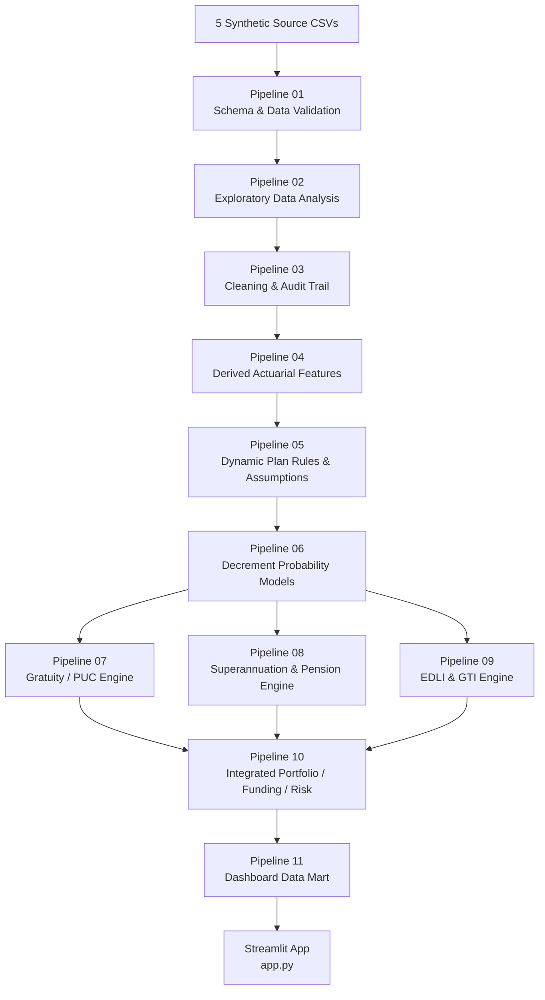

<div align="center">
Quantitative Actuarial Employee Benefits Dashboard
Gratuity · Superannuation · Defined Benefit Pension · EDLI · Group Term Insurance
Hessian-AI Employee Benefits Project  
Author: Mangesh Janardan Bodke
Python · Actuarial Modelling · Probability · Present Value · Funding · Insurance Pricing · Streamlit · Plotly
</div>
---
Project Overview
This repository implements an end-to-end quantitative actuarial modelling and decision-support framework for employee benefits. It connects employee-level data engineering, demographic decrement modelling, financial assumptions, benefit valuation, funding analysis, insurance pricing, governance controls, and an interactive Streamlit dashboard in one reproducible architecture.
The central design principle is simple:
> **One controlled employee master → product-specific eligibility → product-specific actuarial engines → financially distinct outputs → integrated management dashboard.**
The framework covers five major employee-benefit / group-risk views:
Gratuity — service-linked Defined Benefit obligation valued using a Projected Unit Credit framework.
Defined Contribution Superannuation — employer and employee contribution accumulation and future corpus projection.
Defined Benefit Pension — survival-weighted employee and spouse pension cash flows, PUC attribution, plan assets and funded status.
Employees' Deposit Linked Insurance (EDLI) — effective-date-sensitive statutory benefit analytics with explicit official-calculator governance.
Group Term Insurance (GTI) — plan-driven Sum Assured, mortality expected claims, underwriting/free-cover-limit analytics and fresh-model gross premium.
The project is built from synthetic data only. No confidential employer, employee, insurer or client data are used.
---
Technical Foundation
The modelling framework follows the companion 2026 technical manuscript Quantitative Actuarial Modelling of Employee Benefits, an independent Hessian-AI manuscript structured across 8 Parts and 28 Chapters. The book develops the same sequence implemented in this repository: employee data → decrement models → financial assumptions → product engines → integrated institutional decision support.
The modelling philosophy is:
> **Simplest meaning → exact theory → formula → numerical interpretation → actuarial meaning → institutional application.**
The implementation therefore emphasizes not only the numerical output, but also what each quantity means, what assumptions create it, what it must not be confused with, and how it should be governed.
---
Why This Project Matters
Employee-benefit analytics often fail because economically different quantities are mixed together. This repository deliberately separates:
Quantity	Financial meaning
Gratuity / DB Pension DBO	Actuarial liability
Gratuity / Pension plan assets	Assets backing a Defined Benefit promise
DC Superannuation corpus	Member accumulation
EDLI benefit	Statutory contingent death benefit
GTI Sum Assured	Contractual insurance cover
Expected claims	Probability-weighted insurance cost
Insurance premium	Price charged for risk cover
Employer contribution	Cash flow into a fund or account
Actual claim payment	Cash paid after an insured/statutory event
A central governance rule is therefore:
> **Liability ≠ plan assets ≠ DC corpus ≠ insurance cover ≠ expected claims ≠ premium ≠ claim payment.**
This distinction is preserved throughout the pipeline and the dashboard.
---
Current Synthetic Portfolio Snapshot
Master valuation date: 1 September 2026
The current validated synthetic run produces the following portfolio-level outputs:
Metric	Current synthetic result
Clean employee records	9,950
Active employees	8,898
Active Gratuity members	8,675
Active DB Pension members	1,314
Active DC Superannuation members	4,318
Active EDLI members	8,501
Active GTI members	7,913
Gratuity DBO	₹2,972,272,128.60
DB Pension DBO	₹1,658,425,182.15
Combined DB liability	₹4,630,697,310.74
Combined DB plan assets	₹1,648,171,000.00
Combined DB funding ratio	35.59%
Combined DB net funded position	₹-2,982,526,310.74
Annual DC employer contributions	₹583,902,430.07
Annual DC employee contributions	₹86,042,645.03
DC future-contribution corpus	₹59,467,819,156.37
GTI total Sum Assured	₹26,662,668,000.00
GTI fresh expected claims	₹22,906,469.34
GTI fresh-model gross premium	₹28,633,086.68
GTI FCL underwriting referrals	624
GTI FCL referral rate	7.89%
EDLI aggregate qualifying Part B lower range	₹4,445,700,000.00
EDLI aggregate qualifying Part B upper range	₹5,927,600,000.00
Portfolio validation failures	0
Dashboard-mart validation failures	0
These figures are illustrative outputs from the synthetic model, not employer financial statements, actuarial certification, statutory settlements or insurer quotations.
---
End-to-End Architecture

The architecture intentionally separates data preparation, probability modelling, benefit valuation, portfolio aggregation, and presentation. The Streamlit application consumes the validated Pipeline 11 data mart rather than recalculating actuarial values inside the UI.
---
Data Foundation
Five Connected Synthetic Source Files
The project begins with five linked datasets.
File	Purpose	Current design
`employee_census_raw.csv`	Employee master, demographics, employment status and product membership	10,000 raw rows, 40 columns
`salary_history.csv`	Effective-dated salary and benefit-wage history	8 controlled salary fields; latest record ≤ valuation date used where required
`claims_history.csv`	Historical events, exposure windows, Sum Assured and claim amounts	Event/exposure history for decrement and insurance analysis
`plan_assets.csv`	Plan-level assets, contributions, investment income, benefit payments and charges	Plan-level funding data, not employee-level corpus
`plan_rules_assumptions.csv`	Effective-dated product rules and actuarial assumptions	Dynamic plan-level parameters; no universal benefit formula is hard-coded
Controlled Data-Quality Issues
The raw synthetic data deliberately contain realistic quality problems so the validation and cleaning pipelines are testable. Examples include:
duplicate employee identifiers;
missing dates of birth and joining;
missing or anomalous salaries;
status/date conflicts;
invalid joining ages;
missing product plan identifiers;
PF / EDLI membership inconsistencies;
salary-history discontinuities;
claim / exposure exceptions;
plan-rule completeness checks.
The project does not silently delete or overwrite raw data. Every reconstruction, imputation, exclusion or review item is explicitly recorded.
---
The 11-Pipeline Analytical Engine
Pipeline	Engine	Primary purpose
01	Raw Data Validation	File dimensions, schemas, duplicates, chronology, membership and asset reconciliation controls
02	Exploratory Data Analysis	Employee, salary, claims, exposure, plan-rule and product diagnostics without changing raw data
03	Cleaning & Audit Trail	Controlled duplicate resolution, date recovery, salary reconstruction and explicit review flags
04	Derived Actuarial Features	Age, service, retirement horizon, membership flags, salary and exposure features
05	Dynamic Plan Rules & Assumptions	Effective-dated plan-specific benefit, demographic, financial and underwriting parameters
06	Decrement Probability Models	Mortality, withdrawal, disability, early-retirement and competing-decrement active survival
07	Gratuity / PUC Valuation	Projected Unit Credit liability, future exit cash flows, PUC service attribution and funding
08	Superannuation Engine	DC accumulation plus DB Pension employee/spouse liability, PUC and funding analysis
09	EDLI & GTI Engine	Statutory EDLI analytical basis; GTI Sum Assured, expected claims, FCL referrals and pricing
10	Integrated Portfolio / Funding / Risk	Cross-product aggregation, combined DB funding, group risk and workforce concentration
11	Dashboard Data Mart	KPI cards, product/plan summaries, employee drill-down, segmentation, governance and visualization tables
The first six pipelines create a controlled data and probability foundation. Pipelines 07–09 remain product-specific. Pipeline 10 combines only financially compatible quantities. Pipeline 11 converts validated results into a presentation layer.
---
Core Quantitative Modelling Framework
1. Gompertz-Makeham Mortality
Mortality intensity at attained age $x$ is modelled as:
```math
\mu_x = A + Bc^x = A + Be^{\beta x}, \qquad \beta = \ln(c)
```
where:
$A$ = age-independent Makeham component;
$B$ = scale of age-dependent mortality;
$c$ = age-to-age mortality growth factor;
$\mu_x$ = instantaneous mortality intensity at age $x$.
Finite-period survival from age $x$ to age $x+t$ is:
```math
{}_tp_x = \exp\left(-\int_0^t \mu_{x+s}\,ds\right)
```
and the corresponding death probability is:
```math
{}_tq_x = 1-\exp\left(-\int_0^t \mu_{x+s}\,ds\right)
```
The implementation keeps the distinction between hazard/intensity and probability explicit.
---
2. Weibull Withdrawal Model
Employee withdrawal is modelled as a service-duration process.
Retention/survival beyond service duration $t$:
```math
S(t)=\exp\left[-\left(\frac{t}{\eta}\right)^k\right]
```
Withdrawal hazard:
```math
h(t)=\frac{k}{\eta}\left(\frac{t}{\eta}\right)^{k-1}
```
Conditional probability of withdrawal during the next year, given survival in employment to completed service $s$:
```math
q^{W}(s)=1-\frac{S(s+1)}{S(s)}
```
where:
$\eta$ = Weibull scale parameter;
$k$ = Weibull shape parameter.
Interpretation of $k$:
$k<1$: declining withdrawal hazard;
$k=1$: constant hazard / exponential special case;
$k>1$: increasing withdrawal hazard.
---
3. Disability Modelling
The distribution is selected from the observation structure, not from a generic label such as office/factory workforce.
Employee-level disability outcome:
```math
Y_i \sim \operatorname{Bernoulli}(q_i)
```
Homogeneous portfolio count:
```math
X \sim \operatorname{Binomial}(n,q)
```
Rare-event count over employee-year exposure:
```math
D \sim \operatorname{Poisson}(E\mu)
```
where $E$ is employee-year exposure and $\mu$ is an incidence intensity.
---
4. Logistic Early-Retirement Model
Employee-level early-retirement probability is modelled through a logistic transformation:
```math
z_i=\beta_0+\beta_1X_{1i}+\beta_2X_{2i}+\cdots+\beta_pX_{pi}
```
```math
q_i^R=\frac{1}{1+e^{-z_i}}
```
with log-odds:
```math
\ln\left(\frac{q_i^R}{1-q_i^R}\right)=z_i
```
The current synthetic calibration uses employee-year observations and estimates early-retirement behaviour from age and service variables. The model is used as a behavioural decrement, not as a linear probability model.
---
5. Competing Decrements
Death, withdrawal, disability and early retirement operate simultaneously. The first exit removes the employee from active service.
Standalone annual probability $q_j$ is converted to an equivalent intensity:
```math
\lambda_j=-\ln(1-q_j)
```
Total intensity:
```math
\lambda_{\text{total}}=\sum_j \lambda_j
```
Probability of any first exit during the period:
```math
q_{\text{any}}=1-e^{-\lambda_{\text{total}}}
```
Cause-specific first-exit probability:
```math
q_j^*=\left(\frac{\lambda_j}{\lambda_{\text{total}}}\right)q_{\text{any}}
```
Probability of remaining active through $t$ projected periods:
```math
P(\text{active through }t)=\prod_{s=1}^{t} p_s
```
This prevents independent decrement probabilities from being added naively and double-counting the same active exposure.
---
Financial Assumptions
Salary Projection
```math
S_t=S_0(1+g)^t
```
where $S_0$ is current eligible salary, $g$ is annual salary escalation, and $S_t$ is projected salary after $t$ years.
Salary escalation is treated separately from general inflation. It may reflect inflation, merit, promotion and employer-specific wage policy.
Present Value
```math
PV=\frac{FV}{(1+r)^t}
```
where $r$ is the discount rate and $t$ is time to payment.
The liability discount rate and the investment return assumption are deliberately maintained as economically distinct quantities.
---
Gratuity Valuation — Projected Unit Credit
The Gratuity engine follows the four-step PUC logic:
> **Project future benefit → attribute to past service → probability-weight → discount.**
A common statutory-style benefit expression is:
```math
G=\frac{15}{26}\times \text{eligible last-drawn wages}\times \text{qualifying service}
```
The repository does not treat this as a universal hard-coded plan formula. Plan rules may exceed statutory minimums, and eligibility / vesting / rounding / wage basis are resolved from the effective plan-rule layer.
For decrement cause $j$ and future time $t$, a probability-weighted PUC present-value contribution can be represented as:
```math
PV_{j,t}=P(\text{active to }t)\times q^*_{j,t}\times B^{PUC}_{j,t}\times (1+r)^{-t}
```
where $B^{PUC}_{j,t}$ is the projected exit benefit attributable to service already rendered at the valuation date.
The Defined Benefit Obligation is the sum of the relevant probability-weighted discounted future benefit components.
The engine also keeps liability and plan assets separate and reports the funded position explicitly.
---
Defined Contribution Superannuation
A Defined Contribution scheme builds a member accumulation rather than the same type of employer obligation created by a Defined Benefit promise.
Core corpus movement:
```math
\text{Closing Corpus}
=
\text{Opening Corpus}
+
\text{Employer Contributions}
+
\text{Employee Contributions}
+
\text{Investment Earnings}
-
\text{Charges}
-
\text{Benefits Paid}
```
Salary-linked contribution at time $t$:
```math
C_t=c\times S_t
```
where $c$ is the plan-specific contribution rate and $S_t$ is the relevant pensionable salary basis.
Current Data Limitation
Opening individual DC member corpus is not available in the current synthetic source architecture. The engine therefore reports the future-contribution corpus separately and does not substitute pooled plan assets for missing individual member balances.
This is a deliberate governance control, not a calculation failure.
---
Defined Benefit Pension
An illustrative final-salary Defined Benefit pension formula is:
```math
\text{Annual Pension}
=
\text{Accrual Rate}
\times
\text{Final Pensionable Salary}
\times
\text{Service}
```
The probability of reaching retirement is derived from the active-service competing-decrement model.
Value at retirement:
```math
V_R=\sum_k \text{Pension Payment}_k\times P(\text{pensioner alive at }k)\times (1+r)^{-k}
```
Where a spouse pension exists, an additional survivor stream is valued:
```math
V_{spouse}=\sum_k \text{Spouse Payment}_k\times P(\text{employee dead and spouse alive at }k)\times (1+r)^{-k}
```
Current value before PUC attribution:
```math
V_0=V_R\times P(\text{reach retirement eligible})\times (1+r)^{-n}
```
where $n$ is the retirement horizon.
The pension engine then applies PUC service attribution and compares the actuarial liability with plan assets.
---
EDLI — Effective-Date Statutory Engine
EDLI is treated differently from GTI. It is not priced from a mortality model as though it were an employer-designed life policy.
The repository retains an effective-dated statutory rule architecture and requires official-calculator governance.
Conceptually, the official structure compares two routes:
```math
\text{Final EDLI Benefit}=\max(\text{Part A},\text{Part B})
```
A generic Part B structure is:
```math
\text{Part B}
=
\text{capped average wages}\times\text{date-based factor}
+
\text{percentage of Average Progressive Balance}
```
subject to the effective rule set, continuity conditions, floors and ceilings.
Critical Governance Rule
The repository does not claim that an illustrative ceiling or analytical range is automatically the final statutory EDLI settlement. Actual processing remains dependent on the applicable date-of-death rules, required wage history, Average Progressive Balance, continuity conditions and official EPFO processing.
---
Group Term Insurance
GTI is an employer-designed insured death cover. The repository supports three synthetic plan designs.
Flat Cover
```math
SA_i=F
```
where $F$ is the plan's fixed Sum Assured.
Salary-Multiple Cover
```math
SA_i=\min\left[SA_{max},\max\left(SA_{min},mS_i\right)\right]
```
where $m$ is the salary multiple and $S_i$ is the controlled salary basis.
Grade-Based Cover
```math
SA_i=SA_{\text{grade}(i)}
```
where the employee's grade maps to the corresponding plan rule.
Expected Claims
```math
EC=\sum_i Exposure_i\times q_i\times SA_i
```
where $q_i$ is the employee-specific death probability.
Free-Cover-Limit Review
```math
\text{FCL Referral}_i=\mathbf{1}\{SA_i>FCL_i\}
```
Employees above the plan free-cover limit remain visible in the analytical exposure while being separately flagged for underwriting review.
Fresh Gross Premium
For the final dashboard KPI:
```math
\text{Gross Premium}
=
\frac{\text{Fresh Expected Claims}}{1-\text{Loading Rate}}
```
The current synthetic plans use a governed loading rate read from the plan-rule table rather than embedding pricing logic in the dashboard.
---
GTI Experience and Credibility — Implemented but Not Used as Final KPI
The analytical engine also implements standard experience-rating diagnostics:
Actual-to-Expected ratio:
```math
A/E=\frac{\text{Actual Claims}}{\text{Expected Claims}}
```
Limited-fluctuation full credibility:
```math
N_{full}\approx\left(\frac{z}{k}\right)^2
```
Partial credibility:
```math
Z=\min\left(1,\sqrt{\frac{N}{N_{full}}}\right)
```
Experience factor:
```math
F=Z(A/E)+(1-Z)
```
However, the current `claims_history.csv` is an event/exposure history and does not provide a complete historical insured-member denominator suitable for defensible portfolio A/E pricing.
Therefore:
> **Historical GTI credibility-adjusted premium is retained for audit/diagnostic purposes but intentionally excluded from the final management KPI.**
The final dashboard uses the fresh expected-claims pricing basis instead. This is a model-governance decision designed to prevent incomplete exposure data from overstating the quoted premium.
---
Funding and Integrated Portfolio Mathematics
Combined Defined Benefit liability:
```math
L_{DB}=L_{Gratuity}+L_{Pension}
```
Combined funded assets:
```math
A_{DB}=A_{Gratuity}+A_{Pension}
```
Funding ratio:
```math
\text{Funding Ratio}=\frac{A_{DB}}{L_{DB}}
```
Net funded position:
```math
\text{Net Funded Position}=A_{DB}-L_{DB}
```
Funding deficit:
```math
\text{Funding Deficit}=L_{DB}-A_{DB}
```
The integrated portfolio does not add the DC corpus, EDLI analytical range, GTI Sum Assured or insurance premium into the Defined Benefit liability total.
---
Dynamic Plan-Rule Architecture
One of the most important design choices in the repository is that product formulas are not universally hard-coded.
Employee records carry product-plan identifiers. The effective rules live in `plan_rules_assumptions.csv` and are resolved dynamically by `plan_id` and effective date.
Examples of plan-controlled parameters include:
Gratuity benefit days and divisor;
vesting rules and waiver conditions;
salary basis;
salary escalation and discount rates;
retirement age;
DC employer and employee contribution rates;
contribution basis and frequency;
expected investment return and charges;
DB pension accrual rate and spouse percentage;
mortality / withdrawal / disability assumptions;
GTI cover basis, salary multiple, minimum/maximum cover and free-cover limit;
pricing loading;
EDLI effective-date statutory parameters and official-calculator flag.
This architecture makes the engine plan-driven, auditable and extensible.
---
Validation, Audit and Model Governance
The project deliberately distinguishes between validation failures and governance reviews.
Validation Failure
A failure indicates that a mathematical, structural or reconciliation condition has been violated, for example:
invalid probability outside $[0,1]$;
negative liability where not permitted;
broken asset reconciliation;
duplicate model-ready employee grain;
inconsistent plan/company totals;
dashboard totals not reconciling to the portfolio engine.
The current Pipeline 10 and Pipeline 11 runs both report:
> **Validation failures: 0**
Governance Review
A governance review is a documented limitation, fallback or business-review condition, not automatically a mathematical error.
Examples include:
missing individual DC opening corpus;
incomplete spouse continuation information;
explicitly flagged survival fallbacks;
EDLI continuity / wage-history limitations;
historical EDLI events requiring historical effective-date rules;
GTI employees above free-cover limits;
exclusion of historical GTI credibility pricing where the exposure denominator is incomplete.
The dashboard exposes these items instead of hiding them.
---
Streamlit Dashboard
The application is implemented in `app.py` and consumes only the validated Pipeline 11 data mart.
Dashboard Pages
Executive Overview
Headline workforce, Defined Benefit funding and group-risk KPIs.
Funding & Liabilities
Plan-level Gratuity / DB Pension liability, assets, funding ratio and funded-position analysis.
DC Superannuation
Employer/employee contributions and future-contribution corpus by plan.
Group Risk — GTI & EDLI
GTI Sum Assured, expected claims, fresh gross premium, free-cover-limit referrals and EDLI statutory analytical ranges.
Workforce Concentration
Department, location and grade concentration for DB liabilities, DC accumulations and GTI risk exposure.
Employee Drill-Down
Employee-level benefit and risk fields with interactive filters and downloadable filtered data.
Governance & Validation
Transparent display of validation tests, governance reviews, model limitations and controlled fallbacks.
---
Dashboard Data Mart
Pipeline 11 creates the following lightweight Streamlit-ready files under `Data/dashboard_ready/`:
```text
Data/dashboard_ready/
├── dashboard_kpi_cards.csv
├── dashboard_product_overview.csv
├── dashboard_plan_overview.csv
├── dashboard_employee_detail.csv
├── dashboard_segment_risk.csv
├── dashboard_governance.csv
├── dashboard_validation.csv
├── dashboard_filters.csv
├── dashboard_visual_catalog.csv
└── dashboard_manifest.csv
```
This separation allows the web application to remain fast and prevents accidental recalculation of actuarial outputs during UI interaction.
---
Repository Structure
```text
quantitative-actuarial-employee-benefits-dashboard/
│
├── Data/
│   ├── employee_census_raw.csv
│   ├── salary_history.csv
│   ├── claims_history.csv
│   ├── plan_assets.csv
│   ├── plan_rules_assumptions.csv
│   │
│   ├── processed/
│   │   └── ... controlled cleaned datasets ...
│   │
│   ├── model_ready/
│   │   └── ... product and portfolio model outputs ...
│   │
│   └── dashboard_ready/
│       └── ... Pipeline 11 Streamlit data mart ...
│
├── Outputs/
│   ├── 01_data_validation/
│   ├── 02_eda/
│   ├── 03_cleaning/
│   ├── 04_derived_features/
│   ├── 05_plan_rules/
│   ├── 06_decrements/
│   ├── 07_gratuity/
│   ├── 08_superannuation/
│   ├── 09_edli_gti/
│   ├── 10_portfolio_risk/
│   └── 11_dashboard_mart/
│
├── employee_benefits_pipeline.py
├── app.py
├── requirements.txt
└── README.md
```
`employee_benefits_pipeline.py` intentionally contains extensive inline comments so the code itself doubles as technical implementation documentation.
A separate full line-by-line explained-code PDF is planned as the final technical documentation layer after deployment.
---
How to Run Locally
1. Clone the Repository
Clone the repository and open the project root in VS Code or another Python environment.
2. Create / Activate a Python Environment
The project has been developed and tested locally with Python 3.11. Use the same Python version for the closest reproducibility between local development and cloud deployment.
3. Install Dependencies
```bash
python -m pip install -r requirements.txt
```
4. Rebuild the Full Analytical Pipeline
From the repository root:
```bash
python employee_benefits_pipeline.py
```
The full run executes the pipeline sequentially and writes controlled outputs to `Data/processed`, `Data/model_ready`, `Data/dashboard_ready` and `Outputs/`.
5. Launch Streamlit Locally
```bash
python -m streamlit run app.py
```
The local application normally opens at `localhost:8501`.
---
Streamlit Community Cloud Deployment
The deployment architecture is intentionally GitHub-first:
> **Local validated project → GitHub repository → Streamlit Community Cloud → `app.py` entrypoint.**
The repository root contains the Streamlit entrypoint and dependency file required for cloud deployment.
After the first public deployment, the live application link should be added near the top of this README.
Deployment status: local Streamlit application validated; cloud deployment link pending.
---
Reproducibility and Control Principles
The repository follows several implementation controls throughout the 11 pipelines:
Raw data remain unchanged. Cleaning outputs are written separately.
One employee master is reused across product engines.
Product rules are dynamic and effective-dated.
Source fields and derived fields remain distinguishable.
Reconstructed or imputed values are explicitly flagged.
Demographic probabilities are separated from financial assumptions.
Standalone decrement probabilities are reconciled through competing risks.
Valuation, funding, insurance, premium and claim settlement remain separate.
Reviews are not silently converted into assumptions.
Dashboard calculations reconcile to the validated portfolio layer.
The Streamlit UI does not alter actuarial formulas or assumptions.
---
Key Modelling Decisions
Why One Employee Master?
Duplicating employee records across product files creates inconsistent ages, salaries, service and eligibility. The project therefore stores the employee once and uses plan identifiers and product flags to connect the employee to separate benefit engines.
Why Competing Decrements?
An active employee cannot independently experience four first exits during the same exposure period. Converting standalone probabilities to intensities and allocating the total first-exit probability by cause creates a coherent active-service survival path.
Why Separate DC from DB?
A DC corpus is the member's accumulated account. A DB obligation measures an employer's promised benefit. Combining them into one liability number would destroy financial meaning.
Why Exclude GTI Historical Credibility Premium from the Final KPI?
The historical event file does not contain the complete insured-member exposure denominator needed for defensible A/E experience pricing. The engine preserves the diagnostic calculation but prevents it from contaminating the final dashboard premium.
Why Is EDLI Not Treated Like GTI?
EDLI is a statutory, effective-date-sensitive benefit. GTI is employer-designed insurance cover. The same death event may trigger both, but their legal basis, calculation logic and financial meaning remain distinct.
---
Technology Stack
Python 3.11 — analytical engine and application runtime
pandas — data engineering, joins, audit tables and aggregation
NumPy — numerical calculations and vectorized actuarial logic
SciPy / numerical optimization where required — parameter estimation and numerical routines
Statistical / machine-learning methods — logistic early-retirement calibration and model diagnostics
Streamlit — interactive application layer
Plotly — interactive actuarial / funding / risk visualizations
Git / GitHub — version control and deployment source
---
Project Scope and Limitations
This repository is a quantitative educational / analytical system, not a substitute for formal professional work on a live scheme.
Important limitations include:
all employee and plan data are synthetic;
statutory rules can change and must be checked at the relevant effective date;
EDLI final settlement must follow applicable official processing;
the current DC dataset does not contain individual opening member corpus;
some survivor / spouse information is intentionally incomplete and governed through review flags;
historical GTI experience is insufficient for a complete exposure-based credibility premium;
results are not an actuarial certificate, insurer quotation, accounting opinion, legal opinion or tax advice;
deployment demonstrates modelling and decision-support architecture, not production policy administration.
---
Regulatory and Accounting Positioning
Employee-benefit regulation and accounting are date- and jurisdiction-sensitive. The modelling framework is designed so that statutory and plan parameters can be versioned rather than embedded permanently in code.
For employee-benefit accounting, IAS 19 / Ind AS 19 is the directly relevant employee-benefit framework discussed by the companion manuscript. Insurance-contract accounting such as IFRS 17 is a different subject and should not be confused with employer employee-benefit measurement.
Actual statutory benefits, actuarial standards, accounting requirements and insurer terms must always be checked for the applicable valuation date, transaction and jurisdiction.
---
Documentation Roadmap
The repository is designed to contain three documentation layers:
README.md — professional project overview, architecture, formulas, outputs and deployment instructions.
Extensively commented Python source — line-by-line explanation inside `employee_benefits_pipeline.py` and `app.py`.
Explained-Code PDF — final consolidated technical document explaining every pipeline, important code block, formula, data flow, validation and governance decision.
---
Citation
If referencing the methodological framework, use:
> Bodke, Mangesh Janardan. **Quantitative Actuarial Modelling of Employee Benefits: A Comprehensive Framework for Gratuity, Superannuation, Employees' Deposit Linked Insurance and Group Term Insurance.** Hessian-AI independent manuscript, 2026.
---
Author
Mangesh Janardan Bodke  
Hessian-AI Employee Benefits Project  
GitHub: `MangeshTheMathematician`
The project is intended to demonstrate the intersection of actuarial mathematics, probability modelling, financial valuation, insurance pricing, data engineering and institutional decision support.
---
Disclaimer
This repository is provided for educational, analytical and portfolio-demonstration purposes. It does not constitute actuarial, legal, regulatory, accounting, investment, insurance, tax or employment advice. Statutory benefits, accounting requirements, professional standards, policy terms and effective dates must be independently verified before any real-world use.
No third-party insurer, reinsurer, regulator, employer or professional body is represented as endorsing this repository.
---
License
No open-source license is currently granted with this repository. Unless a license is added separately, the code, documentation and manuscript-related material remain subject to applicable copyright law.
---
<div align="center">
Hessian-AI — Quantitative Actuarial Employee Benefits Dashboard  
Valuation · Funding · Decrement Modelling · PUC · Pension · EDLI · GTI · Governance · Decision Support
</div>