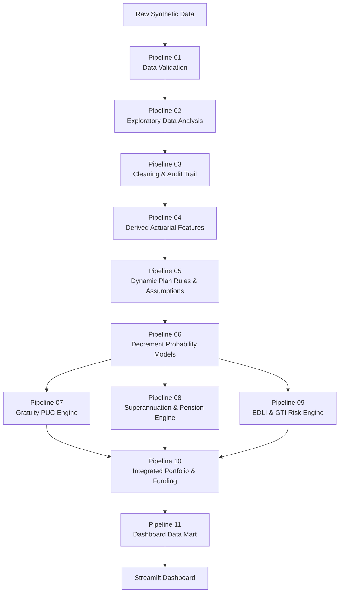

# Quantitative Actuarial Employee Benefits Dashboard

## Gratuity · Superannuation · Defined Benefit Pension · EDLI · Group Term Insurance

**Hessian-AI Employee Benefits Project**

**Author:** Mangesh Janardan Bodke  
**Technology:** Python · pandas · NumPy · Streamlit · Plotly  
**Valuation Date:** 1 September 2026  
**Current Analytical Pipeline:** P11-C01  
**Current Status:** Portfolio and Dashboard Data Mart Validated

---

## Project Overview

This repository implements an end-to-end **quantitative actuarial modelling, employee-benefits analytics, insurance-pricing, funding and decision-support framework**.

The project connects:

- employee-level data engineering;
- demographic decrement modelling;
- financial and salary assumptions;
- plan-specific benefit rules;
- Projected Unit Credit valuation;
- Defined Contribution accumulation;
- Defined Benefit pension valuation;
- statutory EDLI analytics;
- Group Term Insurance pricing;
- funding analysis;
- risk concentration analysis;
- validation and model governance;
- and an interactive Streamlit management dashboard.

The central design principle is:

> **One controlled employee master → product-specific eligibility → product-specific actuarial engines → financially distinct outputs → integrated management dashboard.**

The framework covers five major employee-benefit and group-risk domains:

1. **Gratuity**
2. **Defined Contribution Superannuation**
3. **Defined Benefit Pension**
4. **Employees' Deposit Linked Insurance (EDLI)**
5. **Group Term Insurance (GTI)**

The project is built using **synthetic data only**.

No confidential employer, employee, insurer, client or personally identifiable production data are used.

---

# Executive Portfolio Snapshot

The current validated synthetic portfolio contains:

| Metric | Validated Result |
|---|---:|
| Employee records after cleaning | 9,950 |
| Active employees | 8,898 |
| Active Gratuity members | 8,675 |
| Active DB Pension members | 1,314 |
| Active DC Superannuation members | 4,318 |
| Active EDLI members | 8,501 |
| Active GTI members | 7,913 |
| Gratuity DBO | ₹2,972,272,128.60 |
| DB Pension DBO | ₹1,658,425,182.15 |
| Combined Defined Benefit liability | ₹4,630,697,310.74 |
| Combined Defined Benefit plan assets | ₹1,648,171,000.00 |
| Combined DB funding ratio | 35.59% |
| Combined DB net funded position | -₹2,982,526,310.74 |
| Annual DC employer contributions | ₹583,902,430.07 |
| Annual DC employee contributions | ₹86,042,645.03 |
| Projected DC future-contribution corpus | ₹59,467,819,156.37 |
| GTI total Sum Assured | ₹26,662,668,000.00 |
| GTI fresh expected claims | ₹22,906,469.34 |
| GTI fresh-model gross premium | ₹28,633,086.68 |
| GTI FCL underwriting referrals | 624 |
| GTI FCL referral rate | 7.89% |
| EDLI qualifying Part B lower analytical aggregate | ₹4,445,700,000.00 |
| EDLI qualifying Part B upper analytical aggregate | ₹5,927,600,000.00 |
| Pipeline 10 validation failures | 0 |
| Pipeline 11 validation failures | 0 |

These figures are outputs of a **synthetic actuarial model** and are not production valuations.

---

# System Architecture



The architecture deliberately separates:

- **data quality** from **data cleaning**;
- **assumptions** from **benefit calculations**;
- **decrement probabilities** from **financial assumptions**;
- **Defined Benefit liabilities** from **Defined Contribution accumulations**;
- **statutory EDLI logic** from **GTI insurance pricing**;
- **validation failures** from **governance reviews**;
- and **actuarial engines** from the **visualization layer**.

---

# Repository Structure

```text
quantitative-actuarial-employee-benefits-dashboard/
│
├── Data/
│   │
│   ├── employee_census_raw.csv
│   ├── salary_history.csv
│   ├── claims_history.csv
│   ├── plan_assets.csv
│   ├── plan_rules_assumptions.csv
│   │
│   ├── processed/
│   │
│   ├── model_ready/
│   │
│   └── dashboard_ready/
│
├── Outputs/
│   ├── 01_data_validation/
│   ├── 02_eda/
│   ├── 03_cleaning/
│   ├── 04_features/
│   ├── 05_plan_rules/
│   ├── 06_decrements/
│   ├── 07_gratuity/
│   ├── 08_superannuation/
│   ├── 09_edli_gti/
│   ├── 10_portfolio_risk/
│   └── 11_dashboard_mart/
│
├── employee_benefits_pipeline.py
├── app.py
├── requirements.txt
├── .gitignore
└── README.md
```

---

# Data Architecture

The project begins with **five connected synthetic datasets**.

## 1. Employee Census

Primary file:

```text
Data/employee_census_raw.csv
```

The employee census acts as the controlled employee master.

The project was designed around approximately **10,000 synthetic employee records**, with intentionally injected data-quality issues for validation and cleaning.

Important information includes:

- employee identifier;
- date of birth;
- date of joining;
- date of leaving;
- employment status;
- department;
- location;
- grade;
- salary anchors;
- PF / EDLI eligibility indicators;
- Gratuity plan identifier;
- Superannuation plan identifier;
- GTI plan identifier;
- demographic and employment attributes.

Product plan identifiers remain separate.

Benefit formulas are **not hard-coded into employee records**.

---

## 2. Salary History

Primary file:

```text
Data/salary_history.csv
```

Core fields include:

- `employee_id`
- `effective_date`
- `basic_salary_monthly`
- `dearness_allowance_monthly`
- `gratuity_eligible_wages_monthly`
- `pensionable_salary_annual`
- `edli_eligible_wages_monthly`
- `gross_compensation_annual`

Salary history is time dependent.

For valuation purposes, the engine selects the latest governed salary record effective on or before:

**1 September 2026**

This prevents future salary records from leaking into the valuation.

---

## 3. Claims History

Primary file:

```text
Data/claims_history.csv
```

Core fields include:

- `claim_event_id`
- `employee_id`
- `event_date`
- `event_type`
- `product_type`
- `product_plan_id`
- `exposure_start_date`
- `exposure_end_date`
- `sum_assured_at_event`
- `claim_amount`
- `claim_status`

The table supports:

- claims analysis;
- event analysis;
- historical mortality observations;
- historical exposure diagnostics;
- and descriptive Actual-to-Expected analysis.

A critical modelling decision is discussed later:

> The claims file is **not treated as a complete historical insured-member exposure census** for GTI credibility pricing.

---

## 4. Plan Assets

Primary file:

```text
Data/plan_assets.csv
```

Plan-level fields include:

- `plan_id`
- `product_type`
- `valuation_date`
- `opening_plan_assets`
- `employer_contributions`
- `employee_contributions`
- `investment_income`
- `benefits_paid`
- `expenses_charges`
- `closing_plan_assets`

Plan assets remain separate from employee liabilities.

This distinction is essential.

A pooled plan asset cannot automatically be interpreted as an individual employee asset.

---

## 5. Plan Rules and Assumptions

Primary file:

```text
Data/plan_rules_assumptions.csv
```

This is the controlled actuarial rule layer.

Rather than hard-coding benefit formulas throughout the Python application, assumptions are parameterized by:

- `plan_id`
- `product_type`
- `rule_category`
- `parameter_name`
- `parameter_value`
- `value_type`
- `unit`
- `formula_template`
- `effective_from`
- `effective_to`
- `dashboard_editable_flag`
- source / governance information

This architecture allows different employers or plans to have different:

- benefit formulas;
- salary bases;
- contribution rates;
- retirement ages;
- mortality assumptions;
- salary escalation assumptions;
- discount rates;
- spouse pension percentages;
- GTI cover structures;
- underwriting limits;
- and statutory rules.

---

# The 11-Pipeline Analytical Engine

## Pipeline 01 — Raw Data Validation

Purpose:

- load all source datasets;
- verify file presence;
- inspect row counts;
- inspect column structures;
- validate identifiers;
- validate dates;
- identify missing values;
- identify duplicates;
- detect inconsistent employment records;
- validate plan references;
- perform cross-file reconciliation.

The raw files are **not silently overwritten**.

Pipeline 01 is a validation layer.

---

## Pipeline 02 — Exploratory Data Analysis

Purpose:

- profile the synthetic employee population;
- inspect duplicate structures;
- inspect chronology exceptions;
- inspect salary anomalies;
- inspect missingness;
- inspect membership inconsistencies;
- inspect claims and exposure records;
- inspect plan-asset continuity;
- inspect plan-rule completeness.

The EDA layer produces audit reports without cleaning the source data.

---

## Pipeline 03 — Cleaning and Audit Trail

Purpose:

- remove or reconcile duplicate employee records;
- reconstruct defensible missing values;
- recover valid dates where possible;
- reconcile employment status;
- repair salary observations;
- reconstruct exposure dates where defensible;
- retain explicit cleaning records;
- flag unresolved cases.

Current synthetic cleaning result:

```text
Employee rows: 10,000 -> 9,950
Duplicate rows removed: 50
Post-cleaning validation failures: 0
```

Raw source files remain unchanged.

---

## Pipeline 04 — Derived Actuarial Features

Purpose:

Convert cleaned source data into actuarial model inputs.

Examples include:

- attained age;
- completed service;
- remaining service;
- retirement horizon;
- expected retirement date;
- active employee status;
- product membership flags;
- salary experience;
- decrement exposure;
- model-input quality indicators.

Current model-ready population:

```text
Employee actuarial features: 9,950 rows
Active employees: 8,898
Active Gratuity members: 8,675
Active DB Pension members: 1,314
Active DC Superannuation members: 4,318
Active EDLI members: 8,501
Active GTI members: 7,913
```

---

## Pipeline 05 — Dynamic Plan Rules and Actuarial Assumptions

Purpose:

Resolve employee-specific plan rules without embedding universal formulas directly into Python.

The engine:

- validates plan parameters;
- validates formula templates;
- resolves effective-dated rules;
- distinguishes controlled from editable parameters;
- builds product-plan assignments;
- validates statutory rules;
- builds reusable plan-parameter lookups.

The current controlled architecture includes:

- 11 active plans;
- dynamic formula templates;
- employee-product assignments;
- statutory EDLI rule control.

No employee benefit, liability or premium is calculated in Pipeline 05.

It is the **assumption and rule-governance layer**.

---

## Pipeline 06 — Decrement Probability Models

Purpose:

Model demographic exits from active employment.

The engine includes:

- Gompertz–Makeham mortality;
- Weibull withdrawal;
- disability probability;
- early-retirement logistic modelling;
- active-service projection;
- competing-decrement survival;
- retirement-horizon determination.

These probabilities subsequently feed:

- Gratuity;
- DB Pension;
- GTI expected claims;
- actuarial cash flows.

---

## Pipeline 07 — Gratuity Valuation / Projected Unit Credit

Purpose:

Value Gratuity obligations using a Projected Unit Credit framework.

The engine combines:

- employee service;
- projected salary;
- plan-specific Gratuity rules;
- mortality;
- withdrawal;
- disability;
- retirement;
- present-value discounting;
- plan assets;
- sensitivity analysis.

Current validated result:

```text
Active Gratuity members: 8,675
Employees included in DBO: 8,627
Gratuity DBO: ₹2,972,272,128.60
PUC one-service-year PV: ₹402,766,733.06
Gratuity plan assets: ₹659,564,000.00
Funding ratio: 22.19%
Net funded position: -₹2,312,708,128.60
Validation failures: 0
```

---

## Pipeline 08 — Superannuation Engine

Pipeline 08 separates two fundamentally different structures.

### Defined Contribution Superannuation

The engine models:

- employer contributions;
- employee contributions;
- contribution basis;
- salary projection;
- expected investment return;
- annual charges;
- retirement horizon;
- future-contribution accumulation.

Current result:

```text
Active DC members: 4,318
DC plans valued: 2
Annual employer contributions: ₹583,902,430.07
Annual employee contributions: ₹86,042,645.03
Future-contribution corpus: ₹59,467,819,156.37
```

Opening individual member corpus was unavailable in the synthetic source data.

Therefore the engine does **not** substitute pooled plan assets for individual member balances.

---

### Defined Benefit Pension

The DB Pension engine models:

- pensionable salary;
- salary escalation;
- benefit accrual;
- retirement age;
- active-service survival;
- pensioner mortality;
- pension escalation;
- spouse continuation;
- present-value discounting;
- plan assets;
- funding status;
- sensitivity analysis.

Current result:

```text
Active DB Pension members: 1,314
DB Pension plans valued: 2
Member pension DBO: ₹1,579,599,133.93
Modelled spouse pension DBO: ₹78,826,048.22
Total DB Pension DBO: ₹1,658,425,182.15
PUC one-service-year PV: ₹202,900,075.23
DB Pension plan assets: ₹988,607,000.00
Funding ratio: 59.61%
Net funded position: -₹669,818,182.15
Validation failures: 0
```

---

## Pipeline 09 — EDLI and Group Term Insurance Engine

Pipeline 09 keeps EDLI and GTI financially distinct.

### EDLI

EDLI is treated as:

- statutory;
- effective-date sensitive;
- provident-fund linked;
- subject to current governed rules;
- subject to official-calculator verification.

The model does not treat EDLI as a conventional employer-designed mortality-priced GTI product.

### GTI

The GTI engine models:

- employee Sum Assured;
- mortality probability;
- expected claims;
- free-cover-limit referrals;
- historical claims diagnostics;
- credibility diagnostics;
- fresh gross premium.

Current result:

```text
Active GTI members: 7,913
GTI plans priced: 3
Total Sum Assured: ₹26,662,668,000.00
Fresh expected claims: ₹22,906,469.34
FCL underwriting referrals: 624
```

Pipeline 09 validation failures:

```text
0
```

---

## Pipeline 10 — Integrated Employee Benefits Portfolio, Funding and Risk

Purpose:

Integrate product-engine outputs without recalculating them.

Pipeline 10 produces:

- company-level KPIs;
- product-level summaries;
- plan-level summaries;
- employee-level cross-product risk;
- funding reconciliation;
- workforce concentration analytics;
- governance consolidation.

Current integrated Defined Benefit position:

```text
Gratuity DBO: ₹2,972,272,128.60
DB Pension DBO: ₹1,658,425,182.15
Combined DB Liability: ₹4,630,697,310.74

Combined DB Plan Assets: ₹1,648,171,000.00
Combined DB Funding Ratio: 35.59%
Combined DB Net Funded Position: -₹2,982,526,310.74
```

Pipeline 10 validation failures:

```text
0
```

---

## Pipeline 11 — Dashboard Data Mart and Visualization Layer

Pipeline 11 performs **presentation engineering**, not actuarial revaluation.

It converts Pipeline 10 outputs into lightweight Streamlit-ready tables.

Current dashboard mart:

```text
Executive KPI cards: 16
Product overview rows: 5
Plan overview rows: 11
Employee detail rows: 9,950
Segment concentration rows: 18
Governance rows: 13
Pipeline 10 validation rows: 15
Dashboard filter values: 29
Approved dashboard visuals: 12
```

Pipeline 11 validation failures:

```text
0
```

The final dashboard data layer is stored in:

```text
Data/dashboard_ready/
```

---

# Core Quantitative Modelling Framework

## 1. Gompertz–Makeham Mortality

Mortality intensity at age \(x\) is modelled as:

$$
\mu_x = A + Bc^x
$$

where:

- \(A\) = age-independent Makeham mortality component;
- \(B\) = scale of age-dependent mortality;
- \(c\) = age-to-age mortality growth factor;
- \(x\) = attained age.

For a future period of length \(t\), survival is:

$$
{}_tp_x
=
\exp
\left(
-\int_0^t \mu_{x+s}\,ds
\right)
$$

and death probability is:

$$
{}_tq_x
=
1
-
\exp
\left(
-\int_0^t \mu_{x+s}\,ds
\right)
$$

The implementation explicitly distinguishes:

> **mortality hazard / intensity** from **finite-period death probability**.

Current illustrative GTI mortality parameters are:

$$
A = 0.0002
$$

$$
B = 0.00001
$$

$$
c = 1.10
$$

These are synthetic model parameters, not insurer mortality tables.

---

## 2. Weibull Withdrawal Model

Employee withdrawal is modelled as a service-duration process.

The Weibull survival function is:

$$
S(t)
=
\exp
\left[
-\left(
\frac{t}{\eta}
\right)^k
\right]
$$

where:

- \(\eta\) = Weibull scale parameter;
- \(k\) = Weibull shape parameter;
- \(t\) = completed service duration.

The corresponding hazard is:

$$
h(t)
=
\frac{k}{\eta}
\left(
\frac{t}{\eta}
\right)^{k-1}
$$

The conditional probability of withdrawal during the next period, given survival in employment to service \(s\), is:

$$
q^{w}(s)
=
1
-
\frac{S(s+1)}{S(s)}
$$

Interpretation of \(k\):

- \(k < 1\): declining withdrawal hazard;
- \(k = 1\): constant hazard;
- \(k > 1\): increasing withdrawal hazard.

---

## 3. Disability Modelling

The probability structure is selected according to the observed data structure.

### Employee-Level Disability Outcome

$$
Y_i
\sim
\mathrm{Bernoulli}(q_i)
$$

where:

- \(Y_i = 1\) indicates a disability event;
- \(q_i\) is the employee-specific annual disability probability.

### Homogeneous Portfolio Count

$$
N
\sim
\mathrm{Binomial}(n,q)
$$

where:

- \(n\) = number of employees exposed;
- \(q\) = common disability probability.

### Rare-Event Count Over Exposure

$$
N
\sim
\mathrm{Poisson}(E\mu)
$$

where:

- \(E\) = employee-year exposure;
- \(\mu\) = event intensity.

The model therefore does **not** mechanically label all disability observations with one distribution.

---

## 4. Early-Retirement Logistic Model

Early retirement is modelled using logistic regression.

For employee \(i\):

$$
p_i
=
\frac{
1
}{
1+\exp(-\eta_i)
}
$$

with linear predictor:

$$
\eta_i
=
\beta_0
+
\beta_1 X_{1i}
+
\beta_2 X_{2i}
+\cdots
+
\beta_p X_{pi}
$$

The current synthetic calibration uses employee age and service information.

Pipeline 06 reports:

```text
Employee-year observations: 42,421
Observed early retirements: 103
Maximum-likelihood convergence: True
```

The fitted model is used as a demographic decrement component, not as an accounting or HR recommendation.

---

# Competing Decrements

An employee may be exposed simultaneously to several exit causes.

Examples include:

- death;
- withdrawal;
- disability;
- early retirement;
- normal retirement.

Standalone decrement probabilities cannot simply be added without considering their interaction.

For decrement intensity \(\mu_j(t)\), total active-state survival may be represented conceptually as:

$$
S(t)
=
\exp
\left[
-\int_0^t
\sum_j
\mu_j(s)
\,ds
\right]
$$

The probability assigned to decrement \(j\) is then obtained from its cause-specific intensity while the employee remains active.

This avoids overstating total exit probability.

The competing-decrement engine provides active-service survival used in later benefit valuations.

---

# Salary Projection

Salary-linked benefits require projected remuneration.

A simplified annual salary projection is:

$$
S_t
=
S_0(1+g)^t
$$

where:

- \(S_0\) = salary at the valuation date;
- \(g\) = annual salary escalation assumption;
- \(t\) = projection period in years.

Salary escalation is plan controlled.

The project does not assume that one universal escalation rate applies to every product or plan.

Different salary bases may be required for:

- Gratuity;
- DB Pension;
- DC contributions;
- EDLI;
- GTI.

---

# Present-Value Discounting

A payment occurring \(t\) years in the future is discounted using:

$$
v^t
=
\frac{1}{(1+i)^t}
$$

where:

- \(i\) = annual discount rate;
- \(v\) = one-year discount factor.

For expected cash flow \(CF_t\):

$$
PV
=
\sum_t
CF_t v^t
$$

When demographic probabilities are involved:

$$
EPV
=
\sum_t
p_t
CF_t
v^t
$$

where \(p_t\) represents the relevant probability of reaching or exiting at time \(t\).

---

# Gratuity Valuation

Gratuity is modelled dynamically by plan.

A generic projected benefit structure may be expressed as:

$$
B_t
=
\frac{d_b}{d_v}
\times
S_t
\times
Y_t
$$

where:

- \(d_b\) = governed benefit days;
- \(d_v\) = governed divisor days;
- \(S_t\) = projected eligible monthly salary;
- \(Y_t\) = qualifying service at the benefit event.

The exact formula is controlled by plan rules.

The project does **not** hard-code one universal Gratuity formula for all plans.

Plan rules may differ by:

- benefit days;
- divisor;
- salary basis;
- vesting;
- death waiver;
- disability waiver;
- service rounding;
- salary escalation;
- discount rate;
- retirement age.

---

# Projected Unit Credit Method

For a benefit attributed to employee service, Projected Unit Credit recognizes the portion attributable to service earned by the valuation date.

Conceptually:

$$
DBO_i
=
\sum_t
P_{i,t}
\times
B_{i,t}^{\mathrm{accrued}}
\times
v^t
$$

where:

- \(DBO_i\) = employee \(i\)'s Defined Benefit Obligation;
- \(P_{i,t}\) = probability of the relevant benefit payment;
- \(B_{i,t}^{\mathrm{accrued}}\) = projected benefit allocated to service earned by the valuation date;
- \(v^t\) = discount factor.

The company obligation is:

$$
DBO
=
\sum_i DBO_i
$$

The engine also calculates the present value associated with one additional service year for analytical purposes.

---

# Defined Contribution Superannuation

DC Superannuation is treated as an **accumulation problem**, not a Defined Benefit liability.

If contribution at time \(t\) is \(C_t\), then the projected future-contribution corpus can be represented as:

$$
FV
=
\sum_{t=1}^{T}
C_t
(1+r_{\mathrm{net}})^{T-t}
$$

where:

- \(T\) = retirement horizon;
- \(C_t\) = future contribution;
- \(r_{\mathrm{net}}\) = governed investment accumulation rate net of applicable charges.

Contribution amounts may depend on:

- contribution basis;
- projected salary;
- employer contribution rate;
- employee contribution rate;
- contribution frequency;
- retirement age.

A key governance rule is:

> **Pooled plan assets are not substituted for unavailable employee-level opening DC corpus.**

Therefore the current model explicitly reports a **future-contribution corpus** rather than fabricating opening member balances.

---

# Defined Benefit Pension

A simplified pension-at-retirement structure is:

$$
P_R
=
a
\times
Y_R
\times
S_R
$$

where:

- \(P_R\) = annual pension at retirement;
- \(a\) = pension accrual rate;
- \(Y_R\) = service at retirement;
- \(S_R\) = projected pensionable salary.

The liability must then reflect:

- probability of reaching retirement;
- post-retirement pension survival;
- pension escalation;
- discounting;
- spouse continuation where applicable.

Conceptually:

$$
DBO_i
=
{}_Tp_x
\times
v^T
\times
PV(\text{member pension})
+
PV(\text{spouse pension})
$$

where:

- \({}_Tp_x\) = probability employee \(i\) reaches retirement in active service;
- \(T\) = years to retirement;
- \(v^T\) = discount factor to retirement.

Member pension and spouse pension are modelled separately and reconciled into the total DB Pension obligation.

---

# Group Term Insurance Cover

GTI Sum Assured is determined dynamically from the employee's governed GTI plan.

Three synthetic plan designs are implemented.

## GTI_FLAT_01

Flat cover:

$$
SA_i
=
2{,}000{,}000
$$

---

## GTI_SAL_02

Salary-multiple cover:

$$
SA_i^{raw}
=
3
\times
\mathrm{GrossCompensation}_i
$$

subject to:

$$
SA_i
=
\min
\left(
10{,}000{,}000,
\max(
1{,}500{,}000,
SA_i^{raw}
)
\right)
$$

---

## GTI_GRADE_03

Grade-based Sum Assured:

| Grade | Sum Assured |
|---|---:|
| E1 | ₹1,500,000 |
| E2 | ₹2,000,000 |
| E3 | ₹2,500,000 |
| E4 | ₹3,000,000 |
| E5 | ₹4,000,000 |
| E6 | ₹5,000,000 |
| E7 | ₹7,500,000 |
| E8 | ₹10,000,000 |

Each plan also contains a governed **Free Cover Limit**.

Employees above the applicable Free Cover Limit are identified as underwriting referrals.

---

# GTI Expected Claims

For employee \(i\):

$$
EC_i
=
Exposure_i
\times
q_i
\times
SA_i
$$

where:

- \(Exposure_i\) = insured exposure;
- \(q_i\) = mortality probability;
- \(SA_i\) = Sum Assured.

Portfolio expected claims are:

$$
EC
=
\sum_i
Exposure_i q_i SA_i
$$

The current one-year fresh expected claim estimate is:

$$
EC
=
₹22{,}906{,}469.34
$$

---

# GTI Gross Premium

The controlled loading structure is:

$$
GP
=
\frac{EC}{1-L}
$$

where:

- \(GP\) = gross model premium;
- \(EC\) = expected claims;
- \(L\) = gross premium loading rate.

The synthetic GTI plans currently use:

$$
L = 0.20
$$

Therefore:

$$
GP
=
\frac{
22{,}906{,}469.34
}{
1-0.20
}
$$

which gives:

$$
GP
=
₹28{,}633{,}086.68
$$

This is the **final GTI premium basis used by the integrated dashboard**.

---

# Actual-to-Expected Analysis

Historical mortality experience may be evaluated using:

$$
A/E
=
\frac{
\mathrm{Actual\ Deaths}
}{
\mathrm{Expected\ Deaths}
}
$$

Interpretation:

- \(A/E > 1\): worse mortality experience than expected;
- \(A/E < 1\): better mortality experience than expected;
- \(A/E = 1\): experience equals expectation.

However, a valid A/E denominator requires complete insured exposure.

---

# Limited-Fluctuation Credibility

The model contains an analytical limited-fluctuation credibility framework.

An approximate full-credibility requirement is:

$$
N_{\mathrm{full}}
\approx
\left(
\frac{z}{k}
\right)^2
$$

where:

- \(z\) = confidence parameter;
- \(k\) = relative tolerance.

Partial credibility is:

$$
Z
=
\min
\left(
1,
\sqrt{
\frac{N}{N_{\mathrm{full}}}
}
\right)
$$

A credibility-weighted experience factor may then be expressed as:

$$
F
=
Z
\left(
\frac{A}{E}
\right)
+
(1-Z)
$$

---

# Critical GTI Model-Risk Decision

The historical `claims_history.csv` file contains claims and event records.

It does **not** represent a complete historical membership census containing every insured employee across every historical exposure period.

Therefore it cannot provide a fully defensible historical exposure denominator for GTI credibility pricing.

Applying historical A/E directly produced an unrealistically large pricing adjustment.

The project therefore makes the following explicit governance decision:

> **Historical GTI A/E and credibility outputs are retained for descriptive diagnostics and audit, but they are excluded from the final management premium KPI.**

The final dashboard uses:

$$
\mathrm{Fresh\ Gross\ Premium}
=
\frac{
\mathrm{Fresh\ Expected\ Claims}
}{
1-L
}
$$

This avoids presenting an unsupported historical credibility adjustment as a production premium.

---

# Employees' Deposit Linked Insurance

EDLI is treated differently from GTI.

EDLI is:

- statutory;
- provident-fund linked;
- date sensitive;
- governed by effective-date rules;
- subject to official-calculator verification.

The current controlled synthetic rule set is:

```text
Plan: EDLI_STAT_CURRENT

Effective from: 18 July 2025
Wage factor: 35
Monthly wage ceiling: ₹15,000
PF component rate: 0.50
PF component cap: ₹175,000
Illustrative minimum benefit: ₹250,000
Illustrative maximum benefit: ₹700,000
Part A minimum floor: ₹50,000
Continuity gap parameter: 60 days
Official calculator required: TRUE
```

These values are stored in the controlled plan-rule layer rather than scattered through the calculation code.

---

# EDLI Analytical Structure

A simplified analytical Part B wage component is:

$$
W_i
=
35
\times
\min(
\mathrm{MonthlyWage}_i,
15{,}000
)
$$

The provident-fund component is represented as:

$$
PF_i
=
\min
\left(
0.5
\times
APB_i,
175{,}000
\right)
$$

where \(APB_i\) represents Average Progressive Balance where defensibly available.

An analytical Part B value can then be represented as:

$$
B_i
=
W_i + PF_i
$$

subject to the applicable statutory minimum / maximum and continuity requirements.

However:

> **The dashboard does not describe the analytical EDLI value as the final official statutory settlement.**

Official effective-date processing remains required.

---

# Current EDLI Governance

The current synthetic run reports:

- 8,501 active EDLI members;
- official calculator required;
- true 12-month average wage information unavailable for the current analytical run;
- statutory continuity information unavailable for the current analytical run;
- historical events before the current stored rule date require historical rule selection.

Where a complete historical average is unavailable, a current wage may be used only as an **explicitly flagged analytical proxy**.

The system does not silently present that proxy as official statutory history.

---

# Funding Analysis

Defined Benefit funding is analysed separately from Defined Contribution accumulation.

For a funded DB plan:

$$
\mathrm{Funding\ Ratio}
=
\frac{
\mathrm{Plan\ Assets}
}{
\mathrm{Defined\ Benefit\ Liability}
}
$$

The net funded position is:

$$
\mathrm{Net\ Funded\ Position}
=
\mathrm{Plan\ Assets}
-
\mathrm{Liability}
$$

A negative result represents a funding deficit.

---

# Combined Defined Benefit Position

The integrated portfolio defines:

$$
L_{\mathrm{DB}}
=
L_{\mathrm{Gratuity}}
+
L_{\mathrm{DB\ Pension}}
$$

Current result:

$$
L_{\mathrm{DB}}
=
₹2.972272129\mathrm{B}
+
₹1.658425182\mathrm{B}
$$

Therefore:

$$
L_{\mathrm{DB}}
=
₹4.630697311\mathrm{B}
$$

Combined DB assets are:

$$
A_{\mathrm{DB}}
=
₹1.648171000\mathrm{B}
$$

Funding ratio:

$$
\frac{
1.648171000
}{
4.630697311
}
\approx
35.59\%
$$

Net funded position:

$$
1.648171000
-
4.630697311
=
-₹2.982526311\mathrm{B}
$$

---

# Why DC Is Not Added to DB Liability

The projected DC corpus represents accumulated contributions.

The DB obligation represents a promised benefit liability.

These are fundamentally different financial quantities.

Therefore:

$$
\mathrm{Combined\ DB\ Liability}
\neq
\mathrm{Gratuity\ DBO}
+
\mathrm{DB\ Pension\ DBO}
+
\mathrm{DC\ Corpus}
$$

Instead:

$$
\mathrm{Combined\ DB\ Liability}
=
\mathrm{Gratuity\ DBO}
+
\mathrm{DB\ Pension\ DBO}
$$

The DC corpus is reported separately.

This distinction is intentionally preserved throughout the dashboard.

---

# Model Validation vs Model Governance

The framework deliberately separates two concepts.

## Validation Failure

A validation failure indicates that a mathematical, structural or reconciliation rule has failed.

Examples:

- duplicate employee keys;
- negative liability;
- mortality probability outside \([0,1]\);
- broken funding reconciliation;
- plan totals not matching employee totals;
- missing mandatory model output.

These require correction.

---

## Governance Review

A governance review is not automatically a model failure.

Examples:

- unavailable historical information;
- controlled fallback assumptions;
- underwriting referrals;
- statutory official-calculator requirement;
- incomplete historical exposure;
- unavailable opening DC member corpus.

These are transparent model limitations or business-review items.

They are documented rather than hidden.

---

# Key Modelling Decisions

## One Employee Master

Employee records are not duplicated simply because an employee participates in several benefit products.

One employee remains one employee.

Product participation is represented through plan identifiers and membership flags.

---

## Dynamic Plan Rules

Benefit formulas are not treated as universal constants.

Plan-specific assumptions are resolved from the controlled plan-rule layer.

---

## Effective-Date Governance

Plan and statutory rules can change over time.

The framework supports:

- `effective_from`;
- `effective_to`;
- controlled rule selection.

---

## Probability and Financial Assumptions Remain Distinct

Demographic assumptions include:

- mortality;
- withdrawal;
- disability;
- retirement.

Financial assumptions include:

- salary escalation;
- discount rates;
- pension escalation;
- investment returns;
- charges.

They are not conceptually mixed.

---

## Hazard Is Not Probability

The implementation distinguishes an instantaneous hazard or intensity from a finite-period event probability.

For example:

$$
\mu_x
\neq
q_x
$$

although one may be used to derive the other.

---

## Competing Risks Matter

Standalone decrement probabilities cannot simply be added when several mutually exclusive exits compete over the same exposure interval.

The model therefore constructs active-service survival before allocating exit probabilities.

---

## Product Engines Remain Independent

Gratuity, Pension, DC, EDLI and GTI are calculated separately.

Pipeline 10 integrates their outputs only after the product engines have been validated.

---

## Raw Data Are Preserved

The project does not silently overwrite raw data.

Cleaning creates processed and model-ready outputs plus an audit trail.

---

## No Unsupported Precision

Missing information is not automatically filled merely to produce a number.

Examples include:

- unavailable individual DC opening corpus;
- incomplete historical GTI exposure;
- missing EDLI continuity history;
- statutory official-calculator requirements.

---

# Dashboard Architecture

The Streamlit application consumes:

```text
Data/dashboard_ready/
```

It does not rerun the actuarial valuation every time a user interacts with the dashboard.

This keeps:

- actuarial calculations;
- dashboard rendering;
- model governance;
- and user interaction

architecturally separate.

---

# Dashboard Pages

## 1. Executive Overview

Displays:

- active employees;
- product membership;
- combined DB liability;
- plan assets;
- funding ratio;
- funding deficit;
- GTI Sum Assured;
- GTI expected claims;
- GTI fresh gross premium;
- FCL referrals;
- portfolio charts.

---

## 2. Funding & Liabilities

Displays:

- Gratuity liabilities;
- DB Pension liabilities;
- plan assets;
- funding gaps;
- plan funding ratios;
- funded-plan comparisons.

---

## 3. DC Superannuation

Displays:

- DC membership;
- employer contributions;
- employee contributions;
- projected future-contribution corpus;
- DC plan comparisons;
- explicit opening-corpus limitation.

---

## 4. Group Risk — GTI & EDLI

Displays:

### GTI

- Sum Assured;
- expected claims;
- fresh gross premium;
- plan comparisons;
- FCL underwriting referrals.

### EDLI

- covered employees;
- analytical Part B range;
- statutory governance messaging;
- official-calculator requirement.

---

## 5. Workforce Concentration

Allows risk to be analysed by:

- department;
- location;
- grade.

Measures include:

- Defined Benefit liability;
- DC future corpus;
- GTI Sum Assured;
- GTI expected claims;
- GTI fresh gross premium.

---

## 6. Employee Drill-Down

Supports employee-level filtering and analysis by:

- department;
- location;
- grade;
- benefit plan;
- actuarial liability;
- DC contribution;
- GTI exposure;
- underwriting status;
- EDLI analytical information.

Filtered results can be downloaded from the Streamlit application.

---

## 7. Governance & Validation

Displays:

- validation checks;
- validation failures;
- governance review categories;
- model limitations;
- controlled fallbacks;
- underwriting review items.

The dashboard explicitly distinguishes governance reviews from validation failures.

---

# Dashboard Data Mart

Pipeline 11 creates:

```text
Data/dashboard_ready/
│
├── dashboard_kpi_cards.csv
├── dashboard_product_overview.csv
├── dashboard_plan_overview.csv
├── dashboard_employee_detail.csv
├── dashboard_segment_risk.csv
├── dashboard_governance.csv
├── dashboard_validation.csv
├── dashboard_filters.csv
├── dashboard_visual_catalog.csv
└── dashboard_manifest.csv
```

These files are designed specifically for visualization.

The Streamlit application reads these files directly.

---

# Technology Stack

| Layer | Technology |
|---|---|
| Programming | Python |
| Data manipulation | pandas |
| Numerical calculations | NumPy |
| Statistical / actuarial modelling | Python numerical routines |
| Dashboard framework | Streamlit |
| Interactive visualization | Plotly |
| Development environment | VS Code |
| Version control | Git |
| Repository hosting | GitHub |
| Deployment | Streamlit Community Cloud |
| Data format | CSV |
| Documentation | Markdown |

---

# Installation

Clone the repository:

```bash
git clone https://github.com/MangeshTheMathematician/quantitative-actuarial-employee-benefits-dashboard.git
```

Enter the project directory:

```bash
cd quantitative-actuarial-employee-benefits-dashboard
```

Install dependencies:

```bash
python -m pip install -r requirements.txt
```

---

# Running the Analytical Pipeline

Run:

```bash
python employee_benefits_pipeline.py
```

The program executes the analytical pipeline and writes:

```text
Data/processed/
Data/model_ready/
Data/dashboard_ready/

Outputs/01_data_validation/
Outputs/02_eda/
Outputs/03_cleaning/
Outputs/04_features/
Outputs/05_plan_rules/
Outputs/06_decrements/
Outputs/07_gratuity/
Outputs/08_superannuation/
Outputs/09_edli_gti/
Outputs/10_portfolio_risk/
Outputs/11_dashboard_mart/
```

A successful current run ends with:

```text
Pipeline 11 validation failures: 0

Pipeline 11 complete.
No actuarial valuation formulas were recalculated.
Pipeline 10 outputs were converted into dashboard-ready data.
Historical GTI credibility pricing remains excluded from final KPIs.
The data layer is ready for the Streamlit application.
```

---

# Running the Streamlit Dashboard Locally

After the dashboard-ready files have been generated, run:

```bash
python -m streamlit run app.py
```

Streamlit normally provides a local address similar to:

```text
http://localhost:8501
```

The current application has been successfully tested locally.

---

# GitHub-to-Streamlit Deployment

The deployment architecture is:

```text
Local Development
        ↓
Git Commit
        ↓
GitHub Repository
        ↓
Streamlit Community Cloud
        ↓
Public Interactive Dashboard
```

The deployment entrypoint is:

```text
app.py
```

The dependency file is:

```text
requirements.txt
```

Current requirements:

```text
streamlit
pandas
numpy
plotly
```

The Streamlit application reads the committed dashboard data from:

```text
Data/dashboard_ready/
```

---

# Validation Framework

Validation is embedded throughout the analytical pipeline.

Examples include:

- employee-key uniqueness;
- plan-key integrity;
- date chronology;
- salary consistency;
- plan-rule completeness;
- probability bounds;
- non-negative liabilities;
- funding reconciliation;
- employee-to-plan reconciliation;
- product-to-company reconciliation;
- dashboard-to-portfolio reconciliation.

Current major status:

```text
Pipeline 06 decrement validation failures: 0
Pipeline 07 Gratuity validation failures: 0
Pipeline 08 Superannuation validation failures: 0
Pipeline 09 validation failures: 0
Pipeline 10 validation failures: 0
Pipeline 11 validation failures: 0
```

---

# Governance Framework

The system retains explicit governance reporting for cases where information is incomplete or business review is required.

Examples include:

- DC opening member corpus unavailable;
- DB survival fallback cases;
- spouse continuation data limitations;
- EDLI continuity data limitations;
- EDLI historical-rule requirements;
- GTI Free Cover Limit referrals;
- historical GTI credibility premium exclusion.

The objective is not merely to calculate numbers.

The objective is to make every material limitation **visible, auditable and explainable**.

---

# Model Risk and Robustness

The framework applies several model-risk controls.

## Controlled Inputs

Plan rules and assumptions are separated from valuation logic.

## Explicit Fallbacks

Fallbacks are documented rather than hidden.

## Reconciliation

Employee outputs reconcile to:

- plan totals;
- product totals;
- company totals;
- dashboard totals.

## Separation of Financial Meanings

The system prevents inappropriate aggregation between:

- liabilities;
- assets;
- contribution accumulations;
- statutory benefits;
- insured Sum Assured;
- expected claims;
- premiums.

## Historical Exposure Limitation

The GTI credibility issue is explicitly retained as a model-risk decision instead of being hidden by an apparently precise premium number.

---

# Project Scope

This repository demonstrates the intersection of:

- actuarial mathematics;
- probability modelling;
- demographic decrement modelling;
- employee-benefit valuation;
- Defined Benefit funding;
- Defined Contribution accumulation;
- insurance pricing;
- experience analysis;
- data engineering;
- model governance;
- risk concentration;
- interactive analytics;
- institutional decision support.

---

# Project Limitations

The project is intentionally educational, analytical and portfolio oriented.

Important limitations include:

1. All employee and plan data are synthetic.

2. No production employer or insurer data are included.

3. Mortality parameters are illustrative synthetic model parameters rather than insurer pricing tables.

4. The project is not a substitute for a qualified actuarial valuation.

5. Accounting treatment is not presented as jurisdiction-specific professional advice.

6. Individual opening DC member corpus is unavailable in the current synthetic source data.

7. Historical GTI data do not provide a complete insured-member exposure census suitable for final credibility pricing.

8. EDLI statutory benefits require effective-date processing and official verification.

9. Pension and spouse-pension assumptions are modelling assumptions rather than actual employer plan promises.

10. Numerical results should be interpreted within the synthetic assumptions used by the project.

---

# Regulatory and Accounting Positioning

Employee-benefit regulation and accounting treatment are jurisdiction specific.

Examples of standards or frameworks that may become relevant in a production engagement include:

- Indian employee-benefit legislation;
- provident-fund and EDLI rules;
- applicable trust and funding rules;
- insurer policy terms;
- IAS 19;
- Ind AS 19;
- IFRS-related accounting treatment;
- employer-specific plan documentation.

The analytical model is designed so assumptions and statutory parameters can be versioned rather than embedded permanently in source code.

For a production valuation, all legal, regulatory, accounting and insurer requirements must be verified for the applicable:

- valuation date;
- plan;
- employer;
- transaction;
- jurisdiction.

---

# Documentation Roadmap

The repository is designed to contain three documentation layers.

## 1. README

This file provides:

- professional project overview;
- architecture;
- datasets;
- formulas;
- modelling decisions;
- validated outputs;
- governance;
- setup;
- deployment instructions.

## 2. Extensively Commented Python

Both:

```text
employee_benefits_pipeline.py
```

and:

```text
app.py
```

contain extensive inline explanations designed to make the logic readable line by line.

## 3. Explained-Code PDF

A final technical document is planned to explain:

- each pipeline;
- important Python blocks;
- every important actuarial formula;
- input/output flow;
- modelling rationale;
- validation logic;
- governance decisions;
- dashboard architecture.

This document will complement, rather than replace, the source code and README.

---

# Methodological Companion

The technical framework follows the companion manuscript:

> **Bodke, Mangesh Janardan. _Quantitative Actuarial Modelling of Employee Benefits: A Comprehensive Framework for Gratuity, Superannuation, Employees' Deposit Linked Insurance and Group Term Insurance._ Hessian-AI independent manuscript, 2026.**

The manuscript develops the modelling framework across actuarial mathematics, decrement modelling, employee-benefit valuation, funding, group insurance pricing and governance.

---

# Design Philosophy

The modelling philosophy throughout the project is:

> **Simplest meaning → exact theory → formula → numerical interpretation → actuarial meaning → institutional application.**

The implementation therefore prioritizes:

1. financial and actuarial meaning;
2. mathematical correctness;
3. transparent assumptions;
4. reproducibility;
5. auditability;
6. model governance;
7. implementation quality;
8. visual decision support.

Coding is the implementation layer.

The actuarial and financial logic remains the primary layer.

---

# Author

**Mangesh Janardan Bodke**

Hessian-AI Employee Benefits Project

GitHub:

```text
MangeshTheMathematician
```

This project is intended to demonstrate the intersection of:

- actuarial mathematics;
- probability modelling;
- financial valuation;
- insurance pricing;
- data engineering;
- institutional risk analysis;
- and quantitative decision support.

---

# Disclaimer

This repository is provided for **educational, analytical, research and portfolio-demonstration purposes**.

It does not constitute:

- actuarial advice;
- legal advice;
- regulatory advice;
- accounting advice;
- investment advice;
- insurance advice;
- tax advice;
- employment advice.

All data used by the project are synthetic.

Statutory benefits, accounting requirements, professional standards, policy terms, valuation assumptions and effective dates must be independently verified before any real-world application.

No third-party:

- insurer;
- reinsurer;
- regulator;
- employer;
- professional body;
- academic institution

is represented as endorsing this repository.

---

# License

No open-source license is currently granted with this repository.

Unless a license is added separately, the code, documentation and manuscript-related material remain subject to applicable copyright law.

---

## Project Status

**Pipeline Engine:** Validated through P11-C01  
**Dashboard:** Running locally  
**GitHub Repository:** Active  
**Next Stage:** Streamlit Community Cloud deployment

---

**Hessian-AI — Quantitative Actuarial Employee Benefits Dashboard**

**Valuation · Funding · Decrement Modelling · PUC · Pension · EDLI · GTI · Governance · Decision Support**